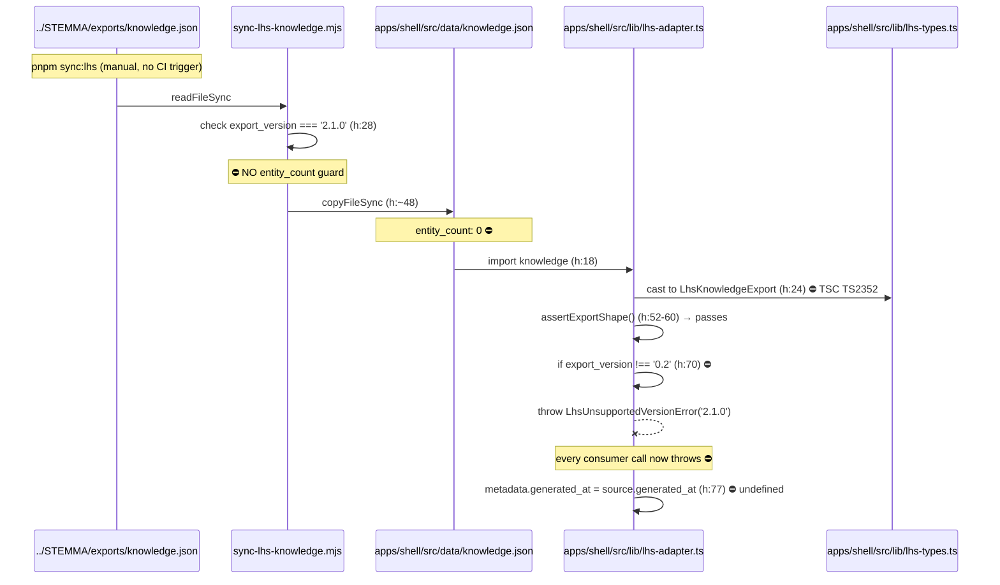
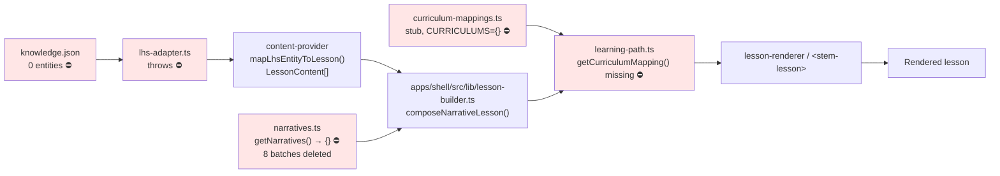
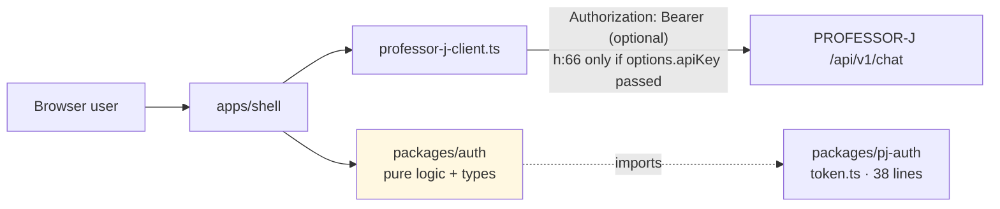
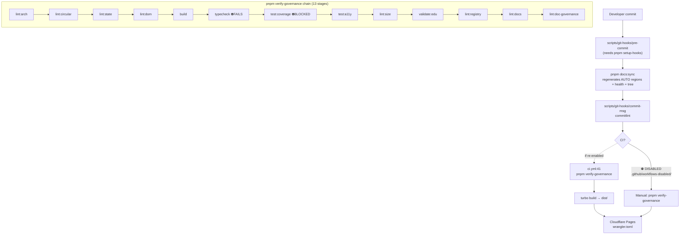

# 04_ARCHITECTURE_AND_DATA_FLOW.md — LearningHub

> **Audit date:** 2026-09-30 · **Mode:** FULL · **Branch:** `main` · **Commit:** `2d4b20974b2c312c75a44d520adb7d42f8388eee` · **Worktree:** CLEAN
> Every box in every diagram corresponds to real, cited code. Valid only for the recorded commit and worktree state.

---

## 1. System type and pattern

| Property | Value | Evidence |
|---|---|---|
| System type | **pnpm monorepo → static SPA + a set of zero-dependency ESM libraries.** Hybrid: 1 deployable app + 24 publishable-but-private packages | `pnpm-workspace.yaml` (`packages/*`, `apps/*`); `package.json` `private: true` |
| Architectural pattern | **Strangler Fig extraction from a frozen monolith** | `docs/adr/001-strangler-fig-migration.md`; `DEVLOG.md` "the Strangler Fig migration is complete" |
| Boundary enforcement | **Compile-time + lint-time, not runtime.** `dependency-cruiser` rules + two eslint configs + madge | `lint:arch` (376 modules, 0 violations), `lint:circular` (0 cycles), `eslint.config.state.mjs`, `eslint.config.dom.mjs` |
| Coupling model | Packages MUST NOT import each other; all cross-package calls via `EventBus`. Sole exceptions: `core`, `tracer` | `AGENTS.md` "Cross-Package Communication"; verified `lint:arch` = 0 violations |
| Purity model | Business logic = pure functions. No `window`/`document`. DOM only in Web Component lifecycles | `eslint.config.dom.mjs` (passes clean); `simulation-core` is 99.14% covered pure math |
| Runtime target | Browser (modern ESM). Node only for build/test tooling | `apps/shell/vite.config.ts`; `engines.node >= 22.13` |
| Deployment target | **Cloudflare Pages** (primary inference), Vercel (config present), Docker (Dockerfile present) | `wrangler.toml`, `vercel.json`, `Dockerfile` |
| **Reality check** | There is **no server, no database, no auth backend, no queue, no cache** in this repository. All 24 feature packages (`auth`, `payments`, `progress`, `admin`, `video`) are **pure client-side logic + types**, not services | verified: no `dependencies` beyond `workspace:*` in any package (`packages/*/package.json`) |

**Key architectural insight:** despite `VISION.md:19` describing "knowledge infrastructure" serving "multiple products", this is a **single static site** plus a curated set of libraries. The infrastructure ambition is expressed as *interfaces and types*, not as running services.

---

## 2. Component and dependency graph

```mermaid
flowchart TB
    subgraph L0["Layer 0 — Foundation (no deps)"]
        CORE["@learninghub/core<br/>EventBus, EventPayload, domain types<br/>98 + 54 lines · 84% floor"]
        PJT["@learninghub/pj-types<br/>P-J API contracts<br/>40 lines · 4 tests"]
        CP["@learninghub/content-provider<br/>LessonContent model + 2 adapters<br/>1,745 lines · 93.91% cov"]
    end

    subgraph L1["Layer 1 — Primitives"]
        TRACER["@learninghub/tracer<br/>spans, decorator, dashboard<br/>1,113 lines · dashboard 0% cov ⚠"]
        ACL["@learninghub/acl<br/>legacy-global adapters<br/>259 lines"]
        AUDIO["@learninghub/audio-synth<br/>Web Audio synth · 502 lines"]
        HOVER["@learninghub/hover-engine<br/>state machine · 171 lines"]
        SIM["@learninghub/simulation-core<br/>pure physics · 1,489 lines · 99.14% ✅"]
        QUIZ["@learninghub/quiz-engine<br/>&lt;stem-quiz&gt; · 1,029 lines"]
    end

    subgraph L2["Layer 2 — Content & Lessons (Phase 8)"]
        CE["@learninghub/content-engine<br/>blueprint pipeline · 1,863 lines"]
        LR["@learninghub/lesson-renderer<br/>&lt;stem-lesson&gt; · 1,252 lines"]
        IS["@learninghub/interactive-simulations<br/>circuit + mechanics sims · 640 lines"]
    end

    subgraph L3["Layer 3 — Features (Phase 7)"]
        AUTH["auth"]; PROG["progress"]; ADM["admin"]; PAY["payments"]; VID["video"]
    end

    subgraph L4["Layer 4 — Orchestration (Phases 9-11)"]
        PJC["pj-client"]; PJA["pj-auth"]; PJAU["pj-audit"]; PJPO["pj-policy"]
        ECD["ecosystem-dashboard"]; CRV["cross-repo-visibility"]
    end

    APP["apps/shell<br/>Vite SPA · 11 routes · 5,113 lines<br/>LARGEST component, weakest governance ⚠"]

    CORE --> TRACER & ACL & AUDIO & HOVER & SIM & QUIZ & AUTH & PROG & ADM & PAY & VID
    CP --> CE & LR
    SIM --> IS
    PJT --> PJC & PJAU & PJPO & CRV
    PJC --> ECD
    AUTH --> PJA
    HOVER -.-> APP
    QUIZ -.-> APP
    SIM -.-> APP
    TRACER -.-> APP
    LR -.-> APP
    IS -.-> APP
    CP -.-> APP
    APP -.->|"professor-j-client.ts:62<br/>fetch POST /api/v1/chat"| PJ["PROFESSOR-J<br/>(external repo)"]

    style APP fill:#ffe6e6
    style ECD fill:#f0f0f0
    style CRV fill:#f0f0f0
    style PJC fill:#f0f0f0
    style PJA fill:#f0f0f0
    style PJAU fill:#f0f0f0
    style PJPO fill:#f0f0f0
```



**Legend:** solid arrows = real `import`/dependency edges (all verified by `dependency-cruiser`). Dotted arrows into `apps/shell` = **consumed by the shell at build time**. Red = unhealthy. Grey = **orphan: zero consumers** (verified by grep — see `05_REGISTRIES.md` §E).

**Dependency direction is strictly downward** — `lint:arch` proves 0 violations across 645 cruised dependencies. There are no cycles (`madge`, 199 files).

---

## 3. Module table

| Path | Responsibility | Depends on | Depended on by | Public surface | LOC | Status |
|---|---|---|---|---|---|---|
| `packages/core` | EventBus, shared event/domain types | — | everything | `EventBus`, `getDefaultEventBus`, `initEventBus`, 6 data interfaces | 741 | ✅ healthy |
| `packages/tracer` | Span tracing, `traced()`, `<stem-tracer-dashboard>` | core | acl, audio, hover, sim, quiz, features | `Tracer`, `traced`, `initTracer` | 1,113 | ⚠️ dashboard 0% |
| `packages/acl` | Anti-corruption adapters over legacy globals | core, tracer | — | `quiz-adapter`, `canvas-adapter`, `audio-adapter` | 259 | ⚠️ wraps deleted `legacy/` |
| `packages/audio-synth` | Web Audio synthesis, mute/volume state | core, tracer | — | `AudioEngine`, `synth*` fns | 502 | ✅ 14 tests |
| `packages/hover-engine` | 6-style hover state machine, cooldown | core, tracer | shell | `initCooldownState`, `pickHoverStyle`, `updateCooldown`, `isStyleInCooldown` | 171 | ✅ 93.54% |
| `packages/simulation-core` | Pure celestial physics math | core, tracer | interactive-sims, shell | `stepPosition`, `interactPair`, `updatePhysics`, `create*` factories | 1,489 | ✅ **99.14%** |
| `packages/quiz-engine` | Quiz logic + `<stem-quiz>` | core, tracer | shell | `createQuizState`, `validateAnswer`, `advanceQuestion` | 1,029 | ✅ 16 tests |
| `packages/content-provider` | **The STEMMA seam.** Lesson model + LHS adapter + narrative/quiz mappers | — | content-engine, lesson-renderer, shell | `mapLhsEntityToLesson`, `LessonContent`, `getNarratives` types | 1,745 | ✅ 93.91% |
| `packages/content-engine` | Blueprint-driven content pipeline, formats, verification gates | content-provider | — | `produce`, `FormatRegistry` | 1,863 | ❌ suite won't load |
| `packages/lesson-renderer` | `<stem-lesson>` Web Component | content-provider, core, tracer | shell | `StemLesson` element | 1,252 | ✅ 56 tests |
| `packages/interactive-simulations` | `<stem-circuit-sim>`, `<stem-mechanics-sim>` | core, tracer, simulation-core | shell | 2 custom elements | 640 | ✅ 19 tests |
| `packages/auth` `progress` `admin` `payments` `video` | Feature **logic + types only** (no backend) | core, tracer | pj-auth (auth only) | per-package API | 253/186/161/207/255 | ✅ 49 tests total |
| `packages/pj-types` `pj-client` `pj-auth` `pj-audit` `pj-policy` | P-J integration contracts & clients | pj-types, auth | **nobody** ⚠️ | per-package API | 113/186/165/199/231 | ✅ tests pass, **0 consumers** |
| `packages/ecosystem-dashboard` `cross-repo-visibility` | Health metrics | pj-client / pj-types | **nobody** ⚠️ | per-package API | 214/195 | ✅ tests pass, **0 consumers** |
| `apps/shell` | **The only deployable.** 11 routes, components, styles, data | 8 packages | — | HTTP routes | 5,113 | ❌ typecheck + 18 tests |

---

## 4. Data architecture

### 4.1 The STEMMA knowledge seam (the critical path — currently BROKEN)



**Four defects on one path:** (1) no empty-corpus guard at sync; (2) stale version pin at `lhs-adapter.ts:22`; (3) unsound cast at `:24`; (4) `generated_at` required by types but absent from the 2.1.0 data. All four stem from one commit, `518615f`, which updated the producer and not the consumer.

### 4.2 The consumer pipeline (what the shell actually renders)



**The content pipeline is severed at four points simultaneously.** `mapLhsEntityToLesson` (`content-provider/src/lhs-adapter.ts:153-195`) is well-written and would work — but nothing reaches it.

### 4.3 Non-knowledge data

| Data | Location | Nature | Status |
|---|---|---|---|
| Shell site content | `apps/shell/src/data/{classes,faqs,pioneers,site,videos}.ts` | Hand-authored TypeScript constants | ✅ used by e2e tests |
| Quiz question bank | `packages/quiz-engine/src/data.ts` (313 lines) | 5 subjects × 4 questions, typed with `EducationalTag` | ✅ validated by `validate:edu` (20 questions) |
| Curriculum mappings | `apps/shell/src/data/curriculum-mappings.ts` | **Stub** (18 lines) | ❌ COR-001 |
| Narrative content | `apps/shell/src/data/narratives.ts` (14 lines) | **Stub** returning `{}` | ❌ deleted in `518615f` |
| Persistent storage | — | **None.** No DB, no localStorage writes for PII, no cookies | ✅ consistent with `SECURITY.md:80` |

---

## 5. Event and auth architecture

### 5.1 EventBus (`packages/core/src/event-bus.ts`, 98 lines)

```
publish(type, payload)
  ├── if debugMode: console.log(`[EVENT BUS] ${type}`, payload)      h:32
  ├── dispatchToLocal(type, payload)                                  h:34
  └── if broadcastChannel: postMessage({type, payload})               h:37  (try/catch swallow)

subscribe(pattern, handler)
  ├── regex = patternToRegex(pattern)      '*' → '.*'                 h:3-7
  ├── push {pattern, regex, handler}                                  h:50
  └── return () => unsubscribe(...)        (returns a disposer)        h:51

dispatchToLocal(type, payload)
  └── for entry of subscribers: if entry.regex.test(type) entry.handler(payload)   h:72-78
```

- **Pattern matching:** wildcards via `patternToRegex` — escapes regex metachars first (`:4`), then `*`→`.*` (`:5`), anchored `^...$` (`:6`). Correct.
- **Cross-tab:** opt-in `BroadcastChannel('learninghub-event-bus')` (`:20`), receives on `onmessage` → `dispatchToLocal` (`:21-24`).
- **Registry:** `subscribe()` **returns a disposer function** — a good, non-obvious API choice that avoids manual `unsubscribe`.
- **⚠️ Not schema-validated** despite `VISION.md:68`'s "schema-validated EventBus" claim and `SECURITY.md:45`'s "MUST be validated with Zod". No Zod dependency exists anywhere. `[CONTRADICTION] C5`
- **⚠️ Silent exception swallowing** at `:25-26` and `:38-39` (empty `catch {}`) — deliberate (best-effort cross-tab) but undocumented; a `DataCloneError` from a non-serializable payload fails silently. `OBS-002`
- **⚠️ No error isolation in dispatch** (`:72-78`): one throwing subscriber aborts the loop for all remaining subscribers. Not currently triggered, but it is a latent reliability gap.

### 5.2 authN / authZ



- **There is no authentication in this repository.** No login flow, no session store, no server-side check. `packages/auth` is pure client-side logic + type declarations (73 + 45 lines).
- `ADRs`: `ECOSYSTEM.md:126` assigns "OAuth2, session validation, user tokens" to the **shared STEMXIS layer**, not here — consistent with `VISION.md:76` ("LearningHub does not manage commercial user signups").
- **`[CONTRADICTION]`** `VISION.md:76` says LH does not manage payment gateways or signups, yet `packages/auth` and `packages/payments` exist (C1).
- **Authorization:** none in-repo. The P-J call passes an optional bearer token if the caller supplies one (`professor-j-client.ts:66`); no caller does.
- **Security posture: browser-only, no secrets server-side, no PII persistence.** The one outbound integration (P-J) is optional and fails safe to a local responder (`:84`). **This is a genuinely low-risk surface** — `SEC-001` is a documentation problem, not a vulnerability.

---

## 6. Build, release, and deployment



**Verified: 13 stages, not 14** (`package.json` → `scripts["verify-governance"]` split on `&&` = 13 entries). Stages 1–5 pass; **stage 6 `typecheck` fails**, so stages 7–13 have never run in sequence. Individually executed, stages 8–13 all pass.

- **Build:** Turborepo orchestration, `dependsOn: ["^build"]`, outputs `dist/**`. Full build = 24/24 in 335 ms for the shell. **Cached aggressively** (`FULL TURBO` on repeat runs) — a hazard for auditing: a stale cache can mask breakage. Mitigated here by `--force` verification.
- **Release:** a **4-stage custom pipeline** deliberately replacing `changeset version`: `release:prepare` → `release:validate` → `release:version` → `release:finalize`, plus `release:rollback`. `changeset:version` is explicitly disabled with an error message (`package.json`).
- **Version guard:** root version bumps are **blocked** unless `.phase.json` shows a newly-completed phase (`release-version.mjs`, per `DEVLOG.md`). **This guard reads the falsified `.phase.json`** (DOC-003) — so the release path is gated on incorrect data.
- **Deploy:** Cloudflare Pages via `wrangler.toml`; `_redirects` added for SPA routing (`925b5e1`). `deploy.yml` is in `workflows-disabled/`. `vercel.json` and a `Dockerfile` also exist but show no recent activity.
- **Scaling / rollback / backup:** not applicable beyond static-asset CDN semantics. No rollback automation beyond `release:rollback` (version metadata).
- **`[UNKNOWN]`:** whether the Cloudflare project (`learninghub2026`) is actually live. No network check was performed.

---

## 7. Failure modes per major component

| Component | Failure mode | Blast radius | Currently mitigated? |
|---|---|---|---|
| `sync-lhs-knowledge.mjs` | Copies an empty/incorrect corpus silently | Every content consumer | ❌ **No** — this is DATA-001 |
| `lhs-adapter.ts` | Throws on version mismatch | All knowledge rendering | ❌ It *is* throwing |
| `curriculum-mappings.ts` | Stub returns `{}` | Learning-path generation | ❌ COR-001 |
| `EventBus` | A throwing subscriber aborts dispatch | All other subscribers in that bus | ❌ No try/catch per handler |
| `EventBus` | Non-serializable payload → silent drop | Cross-tab only | ⚠️ Deliberate but silent |
| `professor-j-client.ts` | P-J unreachable or 500 | Chat feature only | ✅ Falls back to `generateLocalGroundedResponse()` (`:79-84`) |
| `apps/shell` build | Typecheck fails | CI gate | ❌ REL-001 |
| `tracer/dashboard.ts` | Untested | None known (0% coverage) | ⚠️ Unmeasured |
| `docs:sync` | Regenerates from falsified `.phase.json` | ROADMAP, AGENTS, health docs | ❌ Propagates DOC-003 |

---

## 8. Observability, config, and trust boundaries

- **Observability:** `@learninghub/tracer` provides span-based tracing with `?trace=true` (dashboard) and `?debug_events=true` (EventBus console enrichment), auto-detected in `initTracer()` / `initEventBus()` via URL params. **No metrics, no logs aggregation, no traces export, no health checks, no alerting** — consistent with a static site. The tracer's own dashboard is untested.
- **Config surface:** 1 runtime env var actually read (`VITE_PROFESSOR_J_URL` — **undocumented**, DOC-002); 3 build-time-only (commented in `.env.example`); 1 URL-param pair (`?trace`, `?debug_events`); 2 script env vars (`LHS_ROOT`). Full registry in `05_REGISTRIES.md` §B.
- **Trust boundaries:** exactly **one** — `apps/shell` → `PROFESSOR-J /api/v1/chat`. All other code is same-origin, client-side. No server, no DB, no inbound webhook, no upload path, no shell exec.
- **Serialization:** JSON only. `knowledge.json` is the sole large payload (43k lines pre-deletion, now empty).
- **Concurrency/transactions:** none. Single-threaded browser event loop; no locks, no transactions, no async ordering guarantees beyond `Promise.all` in `getNarratives()` (now removed).
