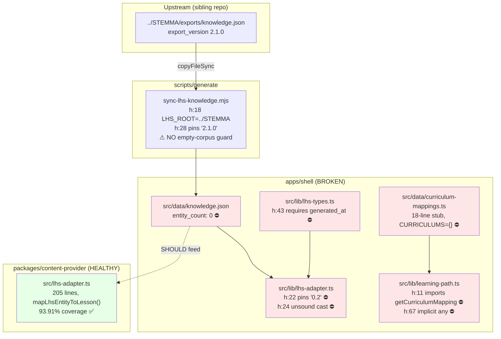
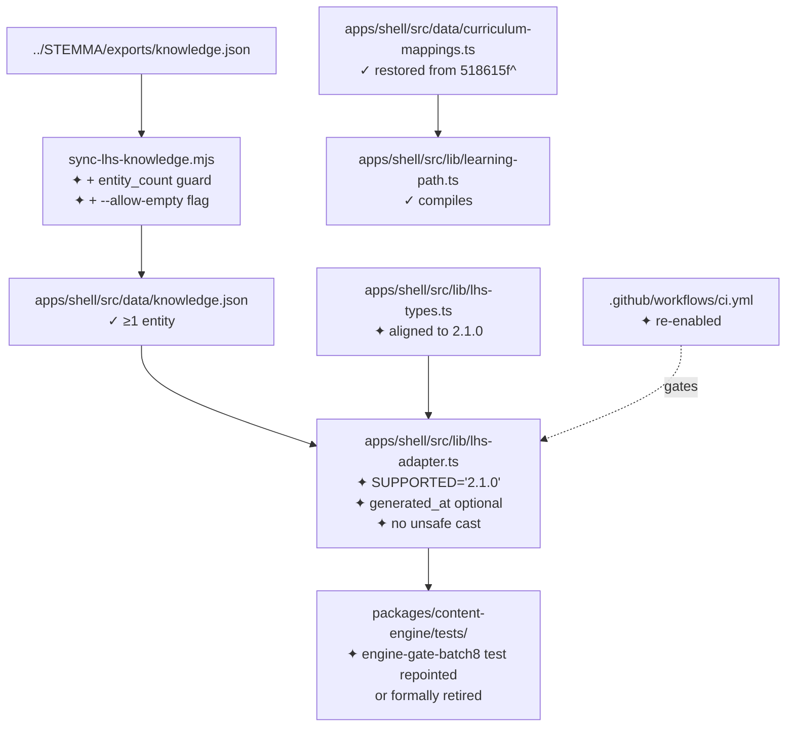

# 10_IMPLEMENTATION_PLAN.md — LearningHub Restore-the-Gate Work Package

> **Audit date:** 2026-09-30 · **Mode:** FULL · **Branch:** `main` · **Commit:** `2d4b20974b2c312c75a44d520adb7d42f8388eee` · **Worktree:** CLEAN
> **Routing:** 10A (internal) · **Confidence:** High
> Valid only for the recorded commit and worktree state. Review all changes since this commit before relying on these conclusions.

---

## 11.1 Header

**Title:** Restore the verification gate and re-establish the STEMMA knowledge seam.

**One-sentence measurable goal:** At the end of this work package, `pnpm verify-governance` exits 0 on `main`, `pnpm test` is green in all 24 packages, and the STEMMA adapter successfully loads the vendored export (or fails loudly with an actionable error when the corpus is empty).

**Problem statement:**
- **What:** Three independent failures make the repository's own quality gate unrunnable, and the single data path that carries canonical STEM knowledge into every consumer throws on every call.
- **Who:** Any agent or developer following `AGENTS.md`, which instructs them to run `pnpm typecheck` / `pnpm test` / `pnpm verify-governance` — all three fail. Any downstream consumer expecting grounded content gets none.
- **Evidence:** `REL-001` (typecheck 47/48), `REL-002` (test 41/48; `content-engine` suite cannot load), `DATA-001` (0 entities), `DOC-001` (4-way version contradiction), `COR-001` (`curriculum-mappings.ts` is a 18-line stub), `DX-001` (CI disabled). All in `07_FINDINGS_AND_RISKS.md`.
- **Why now:** The failure is **one commit old and undetected**. `518615f` (2026-09-20 21:53) deleted the corpus and narrative batches; `2d4b209` (22:16, 23 min later) disabled CI. Nothing has been pushed since. The breakage is at its smallest and the diff is fully understood. Every day this persists, more work accumulates on an unverifiable base.

**Scope:** Make the gate green. Reconcile the STEMMA contract. Restore or formally retire the learning-path contract. Add a corpus-emptiness guard. Re-enable CI.

**Non-goals (explicitly out of scope):**
- Re-authoring narrative content (the 8,494 deleted lines). Recoverable from git but a product decision, not a gate repair.
- Building an ACP/JSON-RPC orchestration plane (claimed in `VISION.md:69`, re-scoped by ADR-022, never implemented).
- Fixing the TypeScript/vitest version split (`DX-002`) — high-risk toolchain churn; recorded as a follow-up ticket.
- Consolidating the duplicated STEMMA adapter into `content-provider` (`ARCH-001`) — architectural; follow-up.
- Rewriting `SECURITY.md` scope (`SEC-001`) — follow-up.
- Any work on the 7 orphan `pj-*`/ecosystem packages.

**Assumptions (must be validated in Phase 0):**
- `[ASSUMPTION]` The STEMMA corpus emptiness is **unintentional** (a sync run against an empty upstream state), not a deliberate decommission. **If false, this plan's Phase 2 becomes invalid and the project must re-route to strategic research.**
- `[ASSUMPTION]` The pre-`518615f` `curriculum-mappings.ts` (547 lines) is recoverable at `518615f^:apps/shell/src/data/curriculum-mappings.ts` and is the correct contract. Verified recoverable; correctness is the assumption.
- `[ASSUMPTION]` `main` is the branch of record and no unmerged branch holds a competing fix. 4 branches are 1–2 commits ahead; all must be checked in Phase 0.
- `[ASSUMPTION]` Re-enabling CI is desired. If CI was disabled deliberately for cost or platform reasons, ticket T7 must instead produce a committed, documented local-gate script.

**Open decisions (require human input):**
- D1: Bump `SUPPORTED_EXPORT_VERSION` to `'2.1.0'` and make `generated_at` optional — **or** pin the export back to a 0.2-era corpus? (Recommendation: bump. The sync script and the data already say 2.1.0.)
- D2: Restore the 547-line `curriculum-mappings.ts`, or retire `learning-path.ts` + its 15 tests? (Recommendation: restore — the tests encode a real, still-valid product contract for curriculum-to-canonical mapping.)
- D3: Was CI disabling intentional? (Blocks T7.)

### Metrics

| Metric | Current baseline (measured 2026-09-30) | Target | Measurement method | Evaluation point |
|---|---|---|---|---|
| `turbo typecheck` exit code | 1 (47/48 tasks) | 0 (48/48) | `pnpm typecheck; echo $?` | End of Phase 1 |
| `turbo test` exit code | 1 (41/48 tasks) | 0 (48/48) | `pnpm test; echo $?` | End of Phase 3 |
| Packages with failing/erroring tests | 3 (`core`, `content-engine`, `apps/shell`) | 0 | per-package `vitest run` | End of Phase 3 |
| `lhs-adapter.loadKnowledge()` | throws `LhsUnsupportedVersionError` | returns `{entityCount: N}` or throws an explicitly actionable empty-corpus error | unit test | Phase 2 |
| STEMMA entities in vendored export | 0 | >0, or a documented decision to allow 0 | `node -e "…entity_count"` | Phase 2 |
| `pnpm verify-governance` exit code | 1 (fails at stage 1) | 0 | `pnpm verify-governance; echo $?` | End of Phase 5 |
| `.github/workflows/` active workflows | 0 (10 parked) | ≥1 (`ci.yml`) | `ls .github/workflows/` | Phase 4 |
| Packages with measured coverage | 4 of 24 | 24 of 24 | `pnpm test:coverage` | End of Phase 5 |
| `docs/audit/*.md` missing Version header | 1 file | 0 | `pnpm --filter @learninghub/core test` | Phase 1 |

---

## 11.2 Design

### A. Current-state architecture of the affected area (cited)



**The structural problem:** the STEMMA seam is implemented **twice** — once in `apps/shell/src/lib/lhs-adapter.ts` (stale, broken, zero coverage) and once in `packages/content-provider/src/lhs-adapter.ts` (healthy, 93.91% coverage, but a *different* interface with a *different* `LhsEntity` shape). `518615f` updated neither. Because `content-engine`'s failing test imports from `apps/shell`, the two are entangled.

### B. Target-state architecture



New/modified/deprecated:
- **Modified:** `lhs-adapter.ts`, `lhs-types.ts`, `sync-lhs-knowledge.mjs`, `content-engine` gate test, `docs/audit/2026-09-17-forensic-audit.md` header.
- **Restored:** `curriculum-mappings.ts` from git history.
- **New:** a contract test asserting the vendored export parses; a `.env.example` entry for `VITE_PROFESSOR_J_URL`.
- **Deprecated:** none removed in this package (avoids compounding risk).

### C. File-level change map

| File | ✓/✦ | Op | Change | Reason | Risk |
|---|---|---|---|---|---|
| `apps/shell/src/lib/lhs-types.ts` | ✓ | Mod | `generated_at` optional; add 2.1.0 metadata fields (`kernel_version`, `content_hash`, `connection_count`, `entities`); update doc comment at `:5` | DOC-001, REL-001 | M |
| `apps/shell/src/lib/lhs-adapter.ts` | ✓ | Mod | `SUPPORTED_EXPORT_VERSION` `'0.2'`→`'2.1.0'`; replace unsafe cast with a validated parse; handle absent `generated_at` | DOC-001, REL-001 | M |
| `apps/shell/src/data/curriculum-mappings.ts` | ✓ | Restore | Recover 547-line implementation from `518615f^` | COR-001, REL-001 | M |
| `apps/shell/src/lib/learning-path.ts` | ✓ | Mod | Only if restore changes the contract shape; otherwise untouched | REL-001 | L |
| `apps/shell/src/lib/lhs-adapter.test.ts` | ✓ | Mod | Add a 2.1.0 fixture case; assert empty-corpus error is actionable | TEST-001 | L |
| `apps/shell/src/lib/*.test.ts` (new) | ✦ | New | Contract test: vendored `knowledge.json` parses against the adapter's declared schema | Prevents recurrence | L |
| `packages/content-engine/tests/engine-gate-batch8.test.ts` | ✓ | Mod | Repoint to a surviving fixture, or delete alongside a recorded decision | REL-002 | L |
| `scripts/generate/sync-lhs-knowledge.mjs` | ✓ | Mod | Fail on `entity_count === 0` unless `--allow-empty` | DATA-001 | L |
| `.env.example` | ✓ | Mod | Add `VITE_PROFESSOR_J_URL`; resolve `VITE_OPENROUTER_API_KEY` | DOC-002 | L |
| `docs/audit/2026-09-17-forensic-audit.md` | ✓ | Mod | Add `**Version:**` header | REL-002 | L |
| `.phase.json` | ✓ | Mod | Mark 9/10/11 complete; close or re-scope 7/8 | DOC-003, PLAN-001 | M |
| `.github/workflows/ci.yml` | ✦ | Move | `workflows-disabled/` → `workflows/` | DX-001 | M |
| `README.md` | ✓ | Mod | Add missing 9 packages to the hand-written tree | DOC-004 | L |

### D. API/interface changes

`LhsKnowledgeExport` (in `apps/shell/src/lib/lhs-types.ts`) — the only public-contract change. Current (stale) vs proposed (2.1.0):

```ts
// CURRENT (lhs-types.ts:44-50) — rejects the shipped data
export interface LhsKnowledgeExport {
  export_version: string;   // data says "2.1.0"
  schema_version: string;
  generated_at: string;     // ⛔ ABSENT in the 2.1.0 export
  source: string;
  entity_count: number;
  entities: LhsEntity[];
}

// PROPOSED (backward-compatible widening)
export interface LhsKnowledgeExport {
  export_version: string;
  schema_version: string;
  /** Optional from export contract 2.1.0; the 2.1.0 export omits it. Use content_hash as the freshness signal. */
  generated_at?: string;
  content_hash?: string;
  kernel_version?: string;
  relation_registry_version?: string;
  source: string;
  entity_count: number;
  entities: LhsEntity[];
}
```
- **Errors:** `LhsUnsupportedVersionError` keeps its shape; add `LhsEmptyCorpusError extends Error` with a message naming `scripts/generate/sync-lhs-knowledge.mjs` and `LHS_ROOT`.
- **AuthZ/idempotency/versioning:** not applicable (pure client-side, no network, no server).
- **Compatibility:** widening optionals is non-breaking for consumers. Bumping `SUPPORTED_EXPORT_VERSION` **is** breaking for any caller passing a 0.2 export — there are none in-repo (grep: no other caller).

### E. Data changes
No schema migrations (no database). The data change is the exported corpus: **0 entities now; N after Phase 2**, contingent on `[ASSUMPTION]` 1. Rollback is `git checkout apps/shell/src/data/knowledge.json` (it is git-tracked, so fully reversible).

### F. Algorithms / processing
No algorithmic changes. The one new piece of logic is the corpus guard:
```
read export → parse → if (export.entity_count === 0 && !allowEmpty) → exit 1 with actionable message
```
Complexity O(1) beyond the existing parse. No concurrency, retries, caching, or rate limits are introduced.

### G. Security & privacy impact
Net **neutral to positive**:
- Removing the `knowledge as LhsKnowledgeExport` cast (`lhs-adapter.ts:24`) replaces an unchecked assertion with a validated parse — a small integrity win.
- No new trust boundaries. No secrets touched. `VITE_PROFESSOR_J_URL` is documented as public-by-construction in `.env.example`'s existing warning block.
- `[RECOMMENDATION]` Do **not** put an OpenRouter key in `VITE_*` (it would be inlined into the public bundle). `SEC-001` recommends removing the unread `VITE_OPENROUTER_API_KEY` rather than wiring it up.
- Required test: assert no secret literal appears in `apps/shell/dist/**` after build.

### H. Observability
- The corpus guard is the key signal: a loud, actionable failure at sync time, replacing today's silent success.
- `[RECOMMENDATION]` Have `docs:sync` surface the vendored entity count in `REPOSITORY_HEALTH.md` so corpus emptiness is visible in a generated doc (it is currently invisible).
- No new logs/metrics/traces. Correlation IDs are not applicable in a static client.

### I. Alternatives considered

| Alternative | Benefits | Costs | Why rejected / when it would win |
|---|---|---|---|
| **A. Delete the duplicated shell adapter; consume `content-provider`'s adapter** | Removes the root cause of DOC-001 permanently; single seam | Rewrites `lhs-adapter.test.ts`, `lhs-demo.test.ts`, `narrative-integration.test.ts`; changes `LessonContent` consumption; adds a package dep to the app | **Deferred to follow-up** — correct long-term (`ARCH-001`), but too large to bundle with a gate repair. Would win if the STEMMA seam is about to be extended. |
| **B. Pin the corpus back to 0.2 instead of bumping the adapter** | Smaller diff (revert `sync-lhs-knowledge.mjs:24` only) | Contradicts the deliberate `518615f` intent; the corpus doesn't exist at 0.2 any more | Rejected. Would win only if a 0.2 corpus were still available upstream. |
| **C. Delete `learning-path.ts` + its 15 tests** | Fastest path to green | Destroys a documented product contract (`ROADMAP` §7 curriculum selection) | Rejected as default; retained as **Open Decision D2**. Would win if curriculum selection is genuinely being retired. |
| **D. Restore narratives from `git show 518615f^`** | Recovers ~8,494 lines of authored content | Enormous scope; re-introduces content that the corpus-sync deliberately removed; product decision | Rejected from scope; recorded as a follow-up. |
| **E. Skip the gate; re-enable CI as-is** | Zero code change | CI would be red immediately, which is honest but not useful | Rejected — CI must be green to be a gate. |

---

## 11.3 Phases

### Phase 0 — Decisions & validation
**Objective:** Resolve the 3 open decisions and confirm the one load-bearing assumption before touching code.
**Prerequisites:** None.
**Tasks:**
1. Confirm `[ASSUMPTION]` 1 with the owner: is the empty STEMMA corpus intentional? **If intentional → STOP and re-route to 10B.**
2. Confirm D1 (bump to 2.1.0), D2 (restore `curriculum-mappings.ts`), D3 (CI intentional?).
3. Run `git diff main...chore/scope-a7-package-rename`, `...docs/implementation-plan-post-rename`, `...feat/physics-grade10-completion`, `...refactor/rename-to-learninghub` — confirm none already fixes REL-001/REL-002.
4. Record baseline: capture current `pnpm typecheck` / `pnpm test` output to `.agent/audit/` as the before-state.
5. Verify `git show 518615f^:apps/shell/src/data/curriculum-mappings.ts > /tmp/cm-prev.ts` succeeds and inspect its exports for `getCurriculumMapping`.

**Files:** none modified.
**Tests:** none.
**Doc updates:** append Phase 0 outcome to `.agent/audit/00_AUDIT_STATE.md`.
**Verification commands + expected output:**
```bash
git show 518615f^:apps/shell/src/data/curriculum-mappings.ts | grep -c 'export function getCurriculumMapping'  # expect: 1
git log --oneline main..feat/physics-grade10-completion  # inspect for competing fix
```
**Exit criteria (all must pass):**
- [ ] Assumption 1 answered; if "intentional", plan halted and re-routed
- [ ] D1/D2/D3 recorded with a decision each
- [ ] No unmerged branch contains a competing fix
- [ ] Pre-change baseline captured to disk
**Risks → mitigations:** owner unavailable → proceed on the recorded recommendations but mark the result PROVISIONAL. **Rollback:** n/a (no changes). **Effort:** XS. **Confidence:** High.

---

### Phase 1 — Foundations (make the type-checker honest)
**Objective:** `pnpm typecheck` exits 0.
**Prerequisites:** Phase 0 decisions.
**Tasks (ordered):**
1. Fix `docs/audit/2026-09-17-forensic-audit.md` — add a `**Version:**` header (unblocks `core`'s doc assertion, cheapest fix in the package).
2. Reconcile `apps/shell/src/lib/lhs-types.ts` to the 2.1.0 contract per §11.2 D (widen `generated_at` to optional; add the 2.1.0 metadata fields; correct the stale doc comment at `:5`).
3. Update `apps/shell/src/lib/lhs-adapter.ts:22` `SUPPORTED_EXPORT_VERSION` → `'2.1.0'`; replace the `as LhsKnowledgeExport` cast at `:24` with a validated parse; add `LhsEmptyCorpusError`.
4. Restore `apps/shell/src/data/curriculum-mappings.ts` from `518615f^` (per D2).
5. Re-run typecheck; if `learning-path.ts` still errors, reconcile its import against the restored module's actual exports (do **not** re-stub).

**Files:** the 4 rows in §11.2 C marked Phase 1 (`lhs-types.ts`, `lhs-adapter.ts`, `curriculum-mappings.ts`, audit doc).
**Tests:** extend `lhs-adapter.test.ts` with (a) a 2.1.0 fixture load, (b) an `entity_count: 0` case asserting `LhsEmptyCorpusError`.
**Doc updates:** none.
**Verification:**
```bash
pnpm typecheck; echo "EXIT=$?"                                   # expect EXIT=0, 48/48
pnpm --filter @learninghub/shell exec tsc --noEmit              # expect: no output
pnpm --filter @learninghub/core test                            # expect: 108 passed
```
**Exit criteria:**
- [ ] `pnpm typecheck` → exit 0, 48/48 tasks
- [ ] `core` test suite fully green (108/108)
- [ ] No `any` introduced; `noUncheckedIndexedAccess` still satisfied
- [ ] `git diff` touches only the 4 intended files
**Risks → mitigations:** the restored `curriculum-mappings.ts` may depend on types that also changed in `518615f` → mitigate by diffing the restored file's imports against current `src/data/` and `src/lib/`; if a helper is also missing, recover it from the same commit. **Rollback:** `git checkout -- apps/shell/src/lib apps/shell/src/data docs/audit`. **Effort:** M. **Confidence:** High.

---

### Phase 2 — Vertical slice (restore the knowledge seam end to end)
**Objective:** The STEMMA adapter loads a non-empty export, and an empty export fails loudly.
**Prerequisites:** Phase 1.
**Tasks:**
1. Investigate upstream: run `LHS_ROOT=../STEMMA node scripts/generate/sync-lhs-knowledge.mjs` and inspect `../STEMMA/exports/knowledge.json` entity count. Determine whether the corpus moved, was emptied, or the path is wrong.
2. Add the empty-corpus guard to `sync-lhs-knowledge.mjs` **first** (so the investigation itself cannot silently re-vendor an empty file).
3. Re-sync with a real corpus; commit the resulting `knowledge.json`.
4. Add the contract test asserting the vendored export parses through the adapter.
5. Fix `narrative-integration.test.ts` + `lhs-demo.test.ts` expectations if they depend on specific entities that no longer exist.

**Files:** `scripts/generate/sync-lhs-knowledge.mjs`, `apps/shell/src/data/knowledge.json`, new contract test, 2 test files.
**Tests:** contract test (parses, entityCount > 0); adapter unit tests from Phase 1.
**Verification:**
```bash
node -e "console.log(require('./apps/shell/src/data/knowledge.json').entity_count)"   # expect: >0
node scripts/generate/sync-lhs-knowledge.mjs                                          # expect: exit 1 if LHS_ROOT points at an empty corpus
cd apps/shell && npx vitest run tests/lhs-adapter.test.ts tests/lhs-demo.test.ts      # expect: all pass
```
**Exit criteria:**
- [ ] Vendored export has `entity_count > 0`, **or** Assumption 1 was answered "allow empty" and `--allow-empty` is used
- [ ] Sync script exits non-zero on an empty corpus without the flag
- [ ] `lhs-adapter.test.ts` + `lhs-demo.test.ts` fully green
- [ ] Adapter rejects a wrong version with a clear error (negative test present)
**Risks → mitigations:** corpus genuinely gone upstream → escalate; this is the one place the plan may halt. Mitigation: do step 2 before step 3 so the failure is explicit, and record `[HYPOTHESIS]` for the owner. **Rollback:** `git checkout apps/shell/src/data/knowledge.json`. **Effort:** M. **Confidence:** Medium (gated on the upstream answer).

---

### Phase 3 — Completion & integration (green the whole suite)
**Objective:** `pnpm test` exits 0 across all 48 turbo tasks.
**Prerequisites:** Phase 2.
**Tasks:**
1. Resolve `packages/content-engine/tests/engine-gate-batch8.test.ts` — either repoint the import to a surviving narrative fixture, or delete the file alongside a recorded decision (ADR or `.phase.json` note). **This is the only test in the repo importing across the app/package boundary; note that as a smell either way.**
2. Re-run the full suite; triage any remaining failures individually — do not batch-fix.
3. Fix `narrative-integration.test.ts` "expected 0 to be greater than 0" if Phase 2 did not.
4. Confirm `learning-path.test.ts` (15 tests) is fully green post-restore.

**Files:** `packages/content-engine/tests/engine-gate-batch8.test.ts`, plus whatever the triage reveals.
**Verification:**
```bash
pnpm test; echo "EXIT=$?"            # expect EXIT=0, 48/48 tasks
for p in packages/*; do (cd $p && npx vitest run 2>&1 | tail -1); done   # all "passed"
```
**Exit criteria:**
- [ ] `pnpm test` → exit 0, 48/48
- [ ] Zero test suites fail to load
- [ ] Zero `×` in any package output
**Risks → mitigations:** hidden failures surface once earlier tasks stop aborting the runner → budget for this; triage one at a time. **Rollback:** per-file `git checkout`. **Effort:** M. **Confidence:** High.

---

### Phase 4 — CI re-enablement
**Objective:** The gate runs automatically again.
**Prerequisites:** Phases 1–3 (CI must be green before it is enabled).
**Tasks:**
1. Resolve D3. If intentional, instead commit a documented `pnpm gate` script + a note in `README.md`.
2. `git mv .github/workflows-disabled/ci.yml .github/workflows/ci.yml` (start with `ci.yml` only — the minimal blast radius).
3. Verify the `docs-sync` job will now pass: the committed `tree.txt` is stamped `4904c3f` (3 commits stale) so `git diff --exit-code -- . ':(exclude)tree.txt'` plus the tree.txt tolerance check must be re-validated. Run `pnpm docs:sync` and commit the result.
4. Confirm `scripts/checks/audit-deps.cjs` runs (it exists — verified) and its `GHSA-jmr9-qjv8-65gv` allowlist is still needed.
5. Add `.agent/` to `.gitignore` **or** commit the audit package — decide explicitly, since `docs-sync`'s `tree.txt` generator will otherwise list it and the `REMAINING=` untracked-file check in `ci.yml` will fail.

**Files:** `.github/workflows/ci.yml` (moved), `.gitignore` or `.agent/**` (new), `tree.txt` (regenerated).
**Verification:**
```bash
ls .github/workflows/            # expect: ci.yml
pnpm docs:sync && git diff --stat # expect: no diff to tracked files (idempotent)
git ls-files --others --exclude-standard   # expect: empty
```
**Exit criteria:**
- [ ] `.github/workflows/ci.yml` exists
- [ ] `pnpm docs:sync` is idempotent on a clean tree
- [ ] `git ls-files --others --exclude-standard` returns nothing
- [ ] `pnpm verify-governance` exits 0
**Risks → mitigations:** first CI run reveals environment-only failures (Node 22 in CI vs 24 locally; `engines.node >= 22.13`) → pin `actions/setup-node` to 22 to match `ci.yml:27` and verify locally first. **Rollback:** move `ci.yml` back to `workflows-disabled/`. **Effort:** S. **Confidence:** Medium.

---

### Phase 5 — Hardening & release verification
**Objective:** Lock the fixes in and measure what was previously unmeasured.
**Prerequisites:** Phase 4.
**Tasks:**
1. Run `pnpm test:coverage` end-to-end for the first time; record real per-package numbers.
2. Raise any floor that is now clearly too low (`tracer` 34 is the obvious candidate — but `dashboard.ts` is 0%; decide whether to test it or accept and **document** the gap).
3. Add a `.env.example` contract test: every `import.meta.env.*` in `apps/shell/src` must appear in `.env.example`. Add `VITE_PROFESSOR_J_URL`; remove or wire `VITE_OPENROUTER_API_KEY` (DOC-002).
4. Update `.phase.json` (DOC-003): mark 9/10/11 complete with versions/dates; make an explicit decision on 7/8 (close or re-scope with a named remaining item).
5. Run `pnpm docs:sync` to regenerate ROADMAP/AGENTS/health blocks from the corrected `.phase.json`.
6. Fix `README.md`'s hand-written repository tree (DOC-004) — 9 missing packages.
7. Re-run `verify-registry.js`; resolve the 3 phantom e2e spec references (TEST-002) by either creating the files or marking the entries `PLANNED`.
8. Final full gate run, then citation spot-check on this audit's claims.

**Files:** `vitest.config.*.ts` (floors), `.env.example`, `.phase.json`, `README.md`, component-registry files.
**Verification:**
```bash
pnpm verify-governance; echo "EXIT=$?"    # expect EXIT=0 — the definition of done
```
**Exit criteria:**
- [ ] `pnpm verify-governance` → exit 0
- [ ] Coverage measured for all 24 packages; numbers recorded in `REPOSITORY_HEALTH.md`
- [ ] `.phase.json`, `ROADMAP.md`, `AGENTS.md` agree with `git log`
- [ ] `README.md` lists all 24 packages
- [ ] `verify-registry.js` emits 0 warnings
- [ ] No secret literals in `apps/shell/dist/**`
**Risks → mitigations:** raising a coverage floor breaks a different package's gate → raise floors one at a time, re-running between. **Rollback:** `git revert` the floor commits. **Effort:** M. **Confidence:** High.

---

## 11.4 Acceptance criteria (Given / When / Then)

1. **Happy path** — Given a clean checkout at the fixed commit, When `pnpm install && pnpm verify-governance` runs, Then it exits 0 with all stages green.
2. **Invalid input** — Given `knowledge.json` with `export_version: "9.9"`, When `loadKnowledge()` is called, Then it throws `LhsUnsupportedVersionError` naming both found and supported versions.
3. **Empty / null** — Given `knowledge.json` with `entity_count: 0`, When `sync-lhs-knowledge.mjs` runs without `--allow-empty`, Then it exits 1 with a message naming `LHS_ROOT` and the expected path.
4. **Boundaries** — Given an export with exactly 1 entity, When the adapter loads it, Then `getAllEntities()` returns length 1 and no section-builder throws on absent optional fields (`symbol`, `unit`, `equation`, `misconceptions`).
5. **Malformed export** — Given a JSON missing `entities`, When `loadKnowledge()` runs, Then `assertExportShape` throws "Malformed STEMMA export: missing export metadata." (`lhs-adapter.ts:58`).
6. **Retry / timeout** — Given a P-J backend at `VITE_PROFESSOR_J_URL` that never responds, When `askProfessorJ()` is called, Then it falls through to `generateLocalGroundedResponse()` and resolves a string (no unhandled rejection). *Already satisfied* — `professor-j-client.ts:79-84`; add a regression test.
7. **Partial dependency failure** — Given the P-J backend returns 500, When `askProfessorJ()` runs, Then the local fallback is used and no error surfaces to the user.
8. **Duplicate requests / restart** — Not applicable (no server, no persistence, no idempotency surface). Explicitly out.
9. **AuthZ failure** — Not applicable in this package (no auth surface touched). Out.
10. **Backward compatibility** — Given a consumer passing a hypothetical `0.2` export, When it loads, Then it fails with the version error — **this is a deliberate, documented break** with zero in-repo callers (verified by grep).
11. **Migration** — Not applicable (no database).
12. **Observability output** — Given an empty corpus, When sync runs, Then the failure message is actionable (names the flag, the env var, and the path) — asserted by test.
13. **Performance limits** — Given the full corpus, When the adapter loads it, Then load completes under 200 ms locally (guards against an O(n²) index build; current implementation is O(n) via `new Map(...)` at `lhs-adapter.ts:73`).
14. **Security-sensitive behavior** — Given a production build, When `apps/shell/dist/**` is scanned for secret literals, Then none are found.

**AI/ML-specific:** Not applicable — this work package introduces no model, prompt, or eval change. (`professor-j-client.ts` contains a static system prompt but it is untouched here; its model default `google/gemini-3.7-flash` at `:38` should be recorded for a future review.)

---

## 11.5 Rollout, migration, reversibility

- **Feature flags:** none needed. No new runtime flags. The one new script flag is `--allow-empty` (sync script, build-time only).
- **Staging:** no staged rollout — this is a repository-internal repair with no user-facing deploy. Cloudflare Pages deploy (`wrangler.toml`) is **not** triggered by this package.
- **Migration ordering:** Phase 1 (types/adapter) must precede Phase 2 (data) — the adapter must be able to parse the new export *before* the new export is vendored. Phase 3 must precede Phase 4 (CI cannot be enabled red).
- **Backfill:** n/a.
- **Rollback triggers:** `pnpm verify-governance` regresses, or any previously-green package turns red.
- **Rollback procedure:** all changes are git-tracked text files in a clean worktree. `git revert <commit-range>` fully reverses every phase. **`knowledge.json` is git-tracked, so the data change is reversible** — this is the key property that makes DATA-001 safe to attempt.
- **Data rollback feasibility:** Fully feasible. No backups required beyond git.
- **Deprecation timeline:** none in this package.
- **Irreversible changes:** **none.** This is the strongest argument for doing this work first.

---

## 11.6 Tickets

| ID | Title | MoSCoW | Purpose | Depends on | Files (✓/✦) | Completion evidence | Public contract? | Parallel? |
|---|---|---|---|---|---|---|---|---|
| **T1** | Align LHS types + adapter to export contract 2.1.0 | **MUST** | Fix DOC-001, unblock REL-001 | Phase 0 | ✓ `lhs-types.ts`, ✓ `lhs-adapter.ts` | `pnpm typecheck` exit 0; adapter tests green | **Y** | N |
| **T2** | Restore `curriculum-mappings.ts` from git | **MUST** | Fix COR-001, unblock REL-001 | T1 | ✓ `curriculum-mappings.ts`, ✓ `learning-path.ts` | `learning-path.test.ts` 15/15 | Y | N |
| **T3** | Add Version header to forensic-audit doc | **MUST** | Unblock `core` suite (REL-002) | — | ✓ `docs/audit/2026-09-17-forensic-audit.md` | `core` tests 108/108 | N | **Y** |
| **T4** | Add empty-corpus guard to sync script | **MUST** | Fix DATA-001 recurrence | — | ✓ `sync-lhs-knowledge.mjs` | Exits 1 on empty corpus; test present | N | **Y** |
| **T5** | Investigate + restore the STEMMA corpus | **MUST** | Fix DATA-001 | T4 | ✓ `knowledge.json` | `entity_count > 0`, or documented decision | N | N |
| **T6** | Resolve `content-engine` gate test | **MUST** | Fix REL-002 | T5 | ✓ `engine-gate-batch8.test.ts` | Suite loads; `pnpm test` exit 0 | N | **Y** |
| **T7** | Re-enable `ci.yml` | **SHOULD** | Fix DX-001 | T1,T2,T3,T6 | ✦ `.github/workflows/ci.yml`, ✓ `.gitignore` | Workflow file present; `docs:sync` idempotent | N | N |
| **T8** | Correct `.phase.json` + regenerate docs | **SHOULD** | Fix DOC-003/PLAN-001 | T5 | ✓ `.phase.json` | `docs:sync` produces no diff; ROADMAP shows 9/10/11 complete | N | **Y** |
| **T9** | Remediate `.env.example` contract | **COULD** | Fix DOC-002 | — | ✓ `.env.example` | New test asserts parity | Y | **Y** |
| **T10** | Measure + record real coverage | **SHOULD** | Fix TEST-001 | T7 | ✓ `vitest.config.*.ts`, ✓ `REPOSITORY_HEALTH.md` | 24/24 packages measured | N | N |
| **T11** | Fix README package tree + registry warnings | **COULD** | Fix DOC-004, TEST-002 | T8 | ✓ `README.md`, ✓ registry files | 0 registry warnings; 24 packages listed | N | **Y** |

---

## 11.7 First 5 PRs

### PR #1 — "docs: add missing Version header to forensic audit note"
- **Purpose:** Clear the single `core`-suite failure. Smallest possible, zero-behaviour-change, unblocks the gate's test stage almost for free.
- **Files:** ✓ `docs/audit/2026-09-17-forensic-audit.md` (add `**Version:**` line consistent with sibling docs).
- **Tests:** none new — existing `packages/core/tests/foundation.test.ts:291` becomes green.
- **Docs:** the file itself.
- **Depends on:** nothing. **Independent of every other PR.**
- **Acceptance:** `pnpm --filter @learninghub/core test` → 108 passed.
- **Verification:** `cd packages/core && npx vitest run 2>&1 | tail -3`
- **Risk:** Low. **Size:** XS (~2 lines).

### PR #2 — "fix(shell): align LHS knowledge contract to STEMMA export 2.1.0"
- **Purpose:** Fix `DOC-001` and the two of three `typecheck` errors rooted in the stale contract.
- **Files:** ✓ `apps/shell/src/lib/lhs-types.ts` (widen `generated_at` to optional; add 2.1.0 metadata; fix the `:5` doc comment), ✓ `apps/shell/src/lib/lhs-adapter.ts` (`:22` version bump; replace the `:24` cast with a validated parse; add `LhsEmptyCorpusError`), ✓ `apps/shell/src/lib/lhs-adapter.test.ts` (+2 cases).
- **Tests:** 2.1.0 fixture loads; `entity_count: 0` raises an actionable error; wrong version rejected.
- **Docs:** inline doc comments only.
- **Depends on:** PR #1 (so the suite is otherwise clean).
- **Acceptance:** `cd apps/shell && npx tsc --noEmit` → clean. Adapter tests green.
- **Verification:** `pnpm --filter @learninghub/shell exec tsc --noEmit`
- **Risk:** **Medium** — this is the only public-contract change (`Public contract? Y`). **Size:** M.

### PR #3 — "fix(shell): restore curriculum-mappings contract from git history"
- **Purpose:** Fix `COR-001` and the remaining `typecheck` error. Restores the 547-line implementation deleted in `518615f` without redesigning it.
- **Files:** ✓ `apps/shell/src/data/curriculum-mappings.ts` (restore from `518615f^`), ✓ `apps/shell/src/lib/learning-path.ts` (only if the restored exports differ from the importer's expectation).
- **Tests:** none new — `learning-path.test.ts`'s 15 existing tests are the specification.
- **Docs:** none.
- **Depends on:** PR #2.
- **Acceptance:** `pnpm typecheck` → **exit 0, 48/48**. `learning-path.test.ts` → 15/15.
- **Verification:** `pnpm typecheck; echo $?`
- **Risk:** Medium (a large file is being reintroduced; its transitive type deps must be checked). **Size:** M.

### PR #4 — "fix(content-engine): repoint the batch-8 gate test off the deleted narrative module"
- **Purpose:** Fix the `content-engine` suite that cannot load (`REL-002`). Independently reviewable; **parallelizable with PRs #2–#3**.
- **Files:** ✓ `packages/content-engine/tests/engine-gate-batch8.test.ts` (repoint to a surviving fixture, or delete with a one-line recorded rationale in the commit body referencing `518615f`).
- **Tests:** the suite must load and pass.
- **Docs:** commit message records the decision.
- **Depends on:** nothing (**parallelizable**).
- **Acceptance:** `cd packages/content-engine && npx vitest run` → 3 suites, 0 load failures.
- **Verification:** `pnpm --filter @learninghub/content-engine test`
- **Risk:** Low. **Size:** S.

### PR #5 — "fix(sync): fail loudly on an empty STEMMA corpus"
- **Purpose:** Fix `DATA-001`'s *recurrence path*. Prevents the exact silent-success that produced this situation.
- **Files:** ✓ `scripts/generate/sync-lhs-knowledge.mjs` (add `entity_count === 0` guard + `--allow-empty`), ✓ a small test.
- **Tests:** guard triggers on a 0-entity fixture; `--allow-empty` bypasses.
- **Docs:** update the script's header comment and note the flag in `README.md`'s Quickstart if relevant.
- **Depends on:** nothing (**parallelizable**).
- **Acceptance:** script exits 1 with an actionable message on an empty corpus.
- **Verification:** `node scripts/generate/sync-lhs-knowledge.mjs; echo $?`
- **Risk:** Low. **Size:** S.

**PR #1 must be small, safe, and useful — satisfied (2 lines, fixes a real gate failure, no behaviour change).**

---

## 11.8 Follow-on work and explicit NOT-TO-BUILD list

**Unlocked by this package (with dependencies):**
1. **Consolidate the duplicated STEMMA seam** (`ARCH-001`) — depends on T1/T2 landing green. Merge `apps/shell/src/lib/lhs-adapter.ts` into `packages/content-provider`, delete the shell copy. Permanently removes DOC-001's root cause.
2. **Single-source the toolchain** (`DX-002`) — depends on T7 (CI to catch regressions). Remove per-package `typescript`/`vitest` declarations; drop the `pnpm-workspace.yaml` overrides.
3. **Re-author or recover narrative content** — depends on T5 (a real corpus) and a product decision. `git show 518615f^:apps/shell/src/data/narratives-batchN.ts` recovers all 8 batches.
4. **Instrument the Phase 8 packages with tracer/EventBus** — the long-standing `ROADMAP.md:277-282` gap. Depends on T6.
5. **Website-only concern:** the `tracer/dashboard.ts` 0% coverage gap (TEST-001).
6. **`SEC-001`:** rewrite `SECURITY.md` scope for the current topology.
7. **Roadmap narrative repair:** record why Phases 7/8 stalled and whether ACP orchestration is formally deferred (ADR).

**NOT-TO-BUILD list (with reasons):**
| Do not build now | Reason |
|---|---|
| An ACP / JSON-RPC orchestration plane | Claimed in `VISION.md:69` + `ECOSYSTEM.md:48-63` but re-scoped away by `ADR-022`; there is no consumer, no server, and no P-J endpoint contract in-repo. Building it would be speculative platform work that `ECOSYSTEM.md:188` explicitly forbids ("Speculative platform layers MUST NOT be built prematurely"). |
| Any feature for the 7 orphan packages (`pj-*`, `ecosystem-dashboard`, `cross-repo-visibility`) | Zero consumers (verified by grep). `pj-client` is imported by nothing; `ecosystem-dashboard` and `cross-repo-visibility` import others but are imported by nobody. Dead surface area; adding more compounds it. |
| A real P-J backend or model client in this repo | `ADR-022` and `VISION.md:74` assign AI execution to PROFESSOR-J. Duplicating it violates the decision the ecosystem was reorganised around. |
| Wiring `VITE_OPENROUTER_API_KEY` into the shell | It would inline a secret into a public browser bundle — directly contrary to `.env.example`'s own warning and `SECURITY.md:34`. Prefer deleting the var. |
| A mobile app (`apps/mobile/`) | Listed as "Future" in `ROADMAP.md` Phase 7; no design, no consumer, and the current shell is not stabilised. |
| Rewriting the shell's tuition estimator out | Product-agnosticism is a real concern (`C1`), but it is a product decision, not a gate repair, and it would break `e2e/critical-path.spec.ts`. Needs an ADR first. |
| Migrating vitest 3→4 or TypeScript 5→7 | Toolchain churn on a currently-red gate; do it after the gate is green and CI catches regressions. |
| Restoring the deleted narrative batches as part of this repair | 8,494 lines of content restored into a system whose data source is still empty is backwards. Corpus first (T5), content second. |
