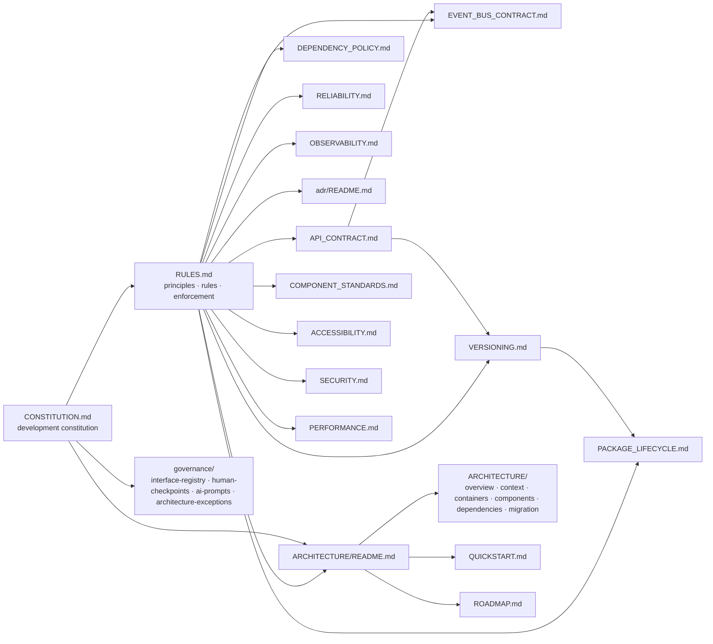

# STEM-TUITION Architecture Charter

**Version:** 3.0.0
**Status:** Active Evolution
**Owner:** Architecture
**Applies To:** All packages, apps, and the root workspace
**Related:** `RULES.md`, `policies/API_CONTRACT.md`, `policies/EVENT_BUS_CONTRACT.md`, `docs/ARCHITECTURE/`, `docs/adr/README.md`
**Project:** STEM-TUITION (independent project, not part of LearningHubSTEM)

---

## Purpose

This document is the **architecture charter**: how the code is organized, how
modules connect, what each package is responsible for, and the rules that govern
those connections. It is the prose counterpart to the C4 diagram set in this
directory (`overview.md`, `context.md`, `containers.md`, `components.md`,
`dependencies.md`, `migration.md`). Previously published as `docs/ARCHITECTURE.md`.

---

## 1.5 Documentation Map

`RULES.md` is the governance **entry point**; it summarizes each policy and points
to its owning document (policy text is authored once, never duplicated). Detail
lives in the docs below. This graph is the current documentation architecture:



Update triggers: any ADR-trigger change, package-topology change (regenerate the
graph), public-contract change, or phase completion MUST update the relevant
diagram (`docs/ARCHITECTURE/overview.md`).

---

## 1. Current State (v1.0.0 Frozen)

The current codebase is a vanilla HTML/CSS/JS monolith. All code lives at the project root. This state is frozen under git tag `v1.0.0` and will never be directly modified (except critical bug fixes).

```
STEM-TUITION/                          ← monolith (frozen)
├── index.html                          ← entry point
├── classes.html, videos.html, ...      ← pages
├── css/main.css                        ← design system
├── css/stem-theme.css                  ← card/hover styles
├── js/stem-effects.js (1311 lines)     ← 4 concerns mixed:
│                                        audio + hover + canvas + controls
├── js/stem-quiz.js (312 lines)         ← quiz data + renderer
├── js/stem-pioneers.js (328 lines)     ← pioneers data + renderer
├── js/main.js (92 lines)               ← DOM helpers
├── tests/verify-stem-platform.js       ← static analysis tests
└── docs/                               ← documentation
```

**Key problems identified:**
1. `stem-effects.js` mixes audio, hover animations, physics canvas, and visual controls — 4 separate concerns in one file
2. Business logic is interleaved with DOM manipulation
3. Global scope functions — no encapsulation
4. No test runner (tests are Node.js scripts doing string matching)
5. No package manager, no build step
6. HTML uses inline event handlers (`onclick`)

---

## 2. Target State (v3.0.0 — Modular)

```
STEM-TUITION/
├── apps/
│   └── shell/                          ← routing shell (thin index.html)
│       └── public/index.html           ← entry point, routes to legacy or modern
│
├── legacy/                             ← FROZEN — never edit
│   ├── index.html
│   ├── classes.html
│   ├── css/
│   ├── js/
│   └── tests/
│
├── packages/                           ← all new development
│   ├── core/                           ← Event Bus, shared types, utilities
│   ├── tracer/                         ← built-in observability (internal Langfuse)
│   ├── acl/                            ← Anti-Corruption Layer adapters
│   ├── audio-synth/                    ← Web Audio API synthesizer
│   ├── quiz-engine/                    ← quiz logic, data, scoring (Web Component)
│   ├── hover-engine/                   ← hover state machine, design tokens
│   └── simulation-core/                ← pure physics math (no canvas/DOM)
│
├── docs/                               ← all documentation
│   ├── RULES.md                        ← governance entry point (principles + rules)
│   ├── ARCHITECTURE/                   ← THIS DIRECTORY (charter README + C4 set)
│   ├── policies/                       ← normative governance
│   │   ├── API_CONTRACT.md             ← public contract versioning
│   │   ├── EVENT_BUS_CONTRACT.md       ← how modules communicate
│   │   ├── OBSERVABILITY.md            ← logs/traces/metrics naming
│   │   ├── DEPENDENCY_POLICY.md        ← dependency evaluation & approval
│   │   ├── RELIABILITY.md              ← timeouts, retries, error handling
│   │   ├── PACKAGE_LIFECYCLE.md        ← package state transitions
│   │   ├── VERSIONING.md               ← semver, compatibility, deprecation, release
│   │   ├── HUMAN_INVOLVEMENT.md        ← human vs. automation contract
│   │   └── PACKAGE_METADATA.md         ← package metadata standards (ARCHITECTURE.toml)
│   ├── guides/                         ← standards, guides, how-tos
│   │   ├── COMPONENT_STANDARDS.md      ← how to build components
│   │   ├── QUICKSTART.md               ← setup guide
│   │   ├── DEBUGGING.md                ← troubleshooting guide
│   │   ├── GLOSSARY.md                 ← technical terms
│   │   ├── FLOWCHARTS.md               ← connection diagrams
│   │   └── DEPLOYMENT.md               ← deployment guide
│   ├── testing/                        ← testing standard + domain checklists
│   │   ├── UNIVERSAL_TESTING_STANDARD.md ← layered taxonomy (levels × attributes × gates)
│   │   ├── education-platform-checklist.md ← domain checklist for this product
│   │   └── pipeline-gap-analysis.md    ← current pipeline vs standard (working)
│   ├── ROADMAP.md                      ← migration phases
│   ├── component-registry/             ← living map of every component + file:line
│   ├── DOCS.md                         ← docs taxonomy (map + update rules)
│   ├── REPOSITORY_HEALTH.md            ← generated health dashboard (docs:sync)
│   └── adr/                            ← Architecture Decision Records (+ README index)
│
├── scripts/                            ← release pipeline, doc sync, tracked hooks
│   ├── generate/docs-sync.mjs          ← deterministic AUTO-section synchronizer
│   ├── generate/sync-versions.mjs      ← syncs **Version:** headers in docs/
│   ├── generate/generate-health.mjs    ← regenerates REPOSITORY_HEALTH.md
│   ├── generate/generate-tree.mjs      ← regenerates docs/tree.txt
│   ├── release/                        ← release pipeline + dev-version identifier
│   ├── checks/                         ← size-check, verify-registry, metadata validation
│   └── git-hooks/pre-commit            ← tracked pre-commit hook (core.hooksPath)
│
├── .changeset/                         ← version bump automation
├── .phase.json                         ← canonical phase-state source
├── pnpm-workspace.yaml
├── turbo.json
├── package.json
└── tsconfig.json
```

---

## 3. Module Dependency Rules

These rules are **enforced by automation** (`pnpm lint:arch`). Violations block merge.

```
         ┌─────────────────────────────┐
         │        apps/shell           │
         │  (can access legacy OR any  │
         │   package via ACL/EventBus) │
         └──────┬──────────────────────┘
                │
    ┌───────────┴───────────┐
    │                       │
    ▼                       ▼
┌──────────────┐    ┌──────────────┐
│   legacy/    │    │  packages/*  │
│  FROZEN ZONE │    │ NEW MODULES  │
│  Read-only   │    │              │
└──────┬───────┘    └──────┬───────┘
       │                   │
       │    ┌──────────────┐
       └────►  packages/   ◄────┘
            │   acl/       │
            │  (adapters)  │
            └──────┬───────┘
                   │
          ┌────────┴────────┐
          ▼                  ▼
┌──────────────────┐  ┌──────────────────┐
│  legacy/         │  │  packages/*      │
│  (via adapter)   │  │  (direct calls)  │
└──────────────────┘  └──────────────────┘
```

### Allowed imports

| From | To | Allowed? | Notes |
|------|----|----------|-------|
| `packages/*` | `legacy/*` | ❌ FORBIDDEN | Must go through `packages/acl/` |
| `packages/*` | `packages/core/` | ✅ Yes | Event Bus is the shared backbone |
| `packages/*` | `packages/tracer/` | ✅ Yes | Any module can be traced |
| `packages/*` | `packages/acl/` | ✅ Yes | Use adapters for legacy access |
| `packages/*` | `packages/*` (other) | ⚠️ Via Event Bus only | No direct function calls between packages |
| `legacy/*` | `packages/*` | ❌ FORBIDDEN | Legacy cannot import new modules |
| `legacy/` | `legacy/` | ✅ Yes | Within frozen zone |
| `apps/shell/` | `legacy/` | ✅ Redirect | Shell delegates to legacy via redirect/iframe |
| `apps/shell/` | `packages/*` | ✅ Yes | Shell loads modern modules directly |

---

## 4. Data Flow

### 4.1 User visits a page

```
Browser → apps/shell/public/index.html
                   │
          ┌────────┴────────┐
          ▼                  ▼
    Is the route        Is the route
    handled by a        ONLY in legacy?
    new module?              │
          │                  ▼
          ▼             Redirect to
    Load from        legacy/{route}.html
    packages/*
```

### 4.2 User interacts with a component

```
User clicks "Check Answer" on quiz
              │
              ▼
  <stem-quiz> Web Component
     │ (dispatches CustomEvent)
     ▼
  Event Bus (packages/core/)
     │ (broadcasts: quiz:answer-submitted)
     ▼
  ┌────────┬────────┬────────┐
  ▼        ▼        ▼        ▼
tracer   quiz-   audio-   analytics
(record  engine  synth    (future)
 timing) (score) (sound)
```

### 4.3 Trace waterfall (visible during debugging)

```
[TRACE] quiz:answer-submitted (45ms)
  ├── quiz-engine:validate-answer (2ms)
  ├── quiz-engine:check-answer (8ms)
  ├── quiz-engine:calculate-score (3ms)
  ├── event-bus:publish (1ms)
  ├── audio-synth:play-correct-sound (25ms)
  └── total: 39ms (time to result)
```

---

## 5. Package Map

| Package | Responsibility | Depends on | Key files |
|---------|---------------|------------|-----------|
| `core` | Event Bus, shared types, utilities | (none) | `src/event-bus.ts`, `src/types.ts` |
| `tracer` | Function timing, span trees, live dashboard | `core` | `src/tracer.ts`, `src/dashboard.ts` |
| `acl` | Adapters wrapping legacy code | `core`, `tracer` | `src/quiz-adapter.ts`, `src/canvas-adapter.ts` |
| `audio-synth` | Web Audio API sound effects | `core`, `tracer` | `src/synth.ts` |
| `quiz-engine` | Quiz data, logic, scoring, Web Component | `core`, `tracer` | `src/quiz-engine.ts`, `src/stem-quiz.ts` |
| `hover-engine` | Hover style state machine, cooldown protocol | `core`, `tracer` | `src/hover-state.ts`, `src/styles.css` |
| `simulation-core` | Pure physics math (Newtonian gravity) | `core`, `tracer` | `src/gravity.ts`, `src/bodies.ts` |
| `shell` | App entry, routing between legacy and modern | (all packages) | `public/index.html` |

---

## 6. Technology Stack

| Domain | Technology | Rationale |
|--------|------------|-----------|
| **Package Manager** | pnpm + Workspaces | Strict dependency isolation, disk efficient |
| **Build Tool** | Turborepo + Vite | Cached builds, fast dev server for new modules |
| **Language** | TypeScript 5.4+ (Strict) | Type safety for debugging, self-documenting |
| **Components** | Web Components (native) | Framework-agnostic, no build required, standard |
| **Styling** | CSS Custom Properties + Modern CSS | Pre-existing design system, no runtime overhead |
| **State Mgmt** | Event Bus (BroadcastChannel) | Native browser API, zero dependencies |
| **Testing** | Vitest (unit), Playwright (E2E), axe (a11y) | Fast, modern, comprehensive |
| **Observability** | `@stem-tuition/tracer` | Built-in, no external service needed |
| **Communication** | CustomEvent + BroadcastChannel | Native browser APIs, framework-agnostic |
| **Versioning** | Changesets + gated 4-stage release pipeline | Changesets record release intent; versions are applied only through `release:prepare → human approval → release:validate → release:version → release:finalize` (docs-only releases supported) |

---

## 7. Educational Metadata Standard

Every learning-related package must export educational metadata:

```typescript
export interface EducationalMetadata {
  conceptId: string;              // e.g. "newtons-second-law"
  displayName: string;            // e.g. "Newton's Second Law of Motion"
  prerequisites: string[];        // e.g. ["force", "mass", "acceleration"]
  gradeLevels: number[];          // e.g. [9, 10, 11, 12]
  estimatedTimeMinutes: number;   // e.g. 15
  commonMisconceptions: string[]; // e.g. ["heavier-objects-fall-faster"]
  tags: string[];                 // e.g. ["physics", "mechanics", "forces"]
}
```

This is used by:
- Component Registry (`docs/component-registry/EDUCATIONAL.md`)
- Debugging tool (shows which concept is being interacted with)
- Future analytics integration

---

## 8. Migration Progress Tracking

**`.phase.json` is the canonical phase-state source.** The ROADMAP progress bar,
per-phase statuses, and the `AGENTS.md` phase-map are `AUTO` regions regenerated
from `.phase.json` by `scripts/generate/docs-sync.mjs` (run automatically by the pre-commit
hook and the release pipeline) — never hand-edit them.

Phase completion is a human decision: set `status: "completed"` in `.phase.json`
(leaving `completedVersion` / `completedDate` `null`); the release pipeline stamps
the release fields.

The extracted-code tracker lives in `docs/component-registry/TRACE.md`:

```
PHASE 0: Foundation    ██████████ 100%
PHASE 1: Observability ██████████ 100%
PHASE 2: Audio Synth   ██████████ 100%
PHASE 3: Event Bus     ██████████ 100%
PHASE 4: Quiz Engine   ██████████ 100%
PHASE 5: Hover Engine  ██████████ 100%
PHASE 6: Physics Core  ██████████ 100%
PHASE 7+: Features     ░░░░░░░░░░ 0%
```

`TRACE.md` is currently **hand-maintained** (not covered by `docs-sync`).

---

## 8.5 Package Maturity

Every `packages/*` and `apps/*` carries architecture metadata in its own
`ARCHITECTURE.toml` (owner, status, maturity, contracts, public API, dependencies,
ADRs). These feed the health dashboard (`docs/REPOSITORY_HEALTH.md`, generated by
`scripts/generate/generate-health.mjs`) and the maturity table below.

| Package | Owner | Status | Maturity | Key contracts | ADRs |
|---------|-------|--------|----------|---------------|------|
| `core` | Core Team | stable | mature | api, interface, schema | 003, 005 |
| `tracer` | Core Team | stable | proven | api, event | 008 |
| `audio-synth` | Core Team | stable | proven | api, schema | — |
| `acl` | Core Team | stable | proven | adapter, event | 003, 004 |
| `quiz-engine` | Core Team | stable | proven | api, event, interface | 002, 003 |
| `hover-engine` | Core Team | incubating | incubating | interface | 002 |
| `simulation-core` | Core Team | incubating | incubating | api, interface, schema | — |
| `apps/shell` | Core Team | experimental | incubating | api | 002, 005 |

Maturity levels: **incubating** (new, breaking changes allowed) →
**proven** (used in production, stable public API) → **mature** (long-lived,
stable for many releases). Lifecycle states follow `PACKAGE_LIFECYCLE.md`
(`experimental → incubating → stable → legacy → deprecated → archived`).

---

## 9. Related Documents

| Document | What it covers |
|----------|---------------|
| `CONSTITUTION.md` | Development constitution: ecosystem vision, operating principles, governance overview, AI session protocol |
| `RULES.md` | Governance entry point: principles, mandatory rules, enforcement |
| `guides/COMPONENT_STANDARDS.md` | How to build a Web Component |
| `policies/EVENT_BUS_CONTRACT.md` | Event naming, payloads, versioning |
| `policies/API_CONTRACT.md` | Public contract versioning, semver, migration |
| `ARCHITECTURE/` | C4 diagram set (overview, context, containers, components, dependencies, migration) |
| `guides/QUICKSTART.md` | Setup and first contribution |
| `guides/DEBUGGING.md` | Troubleshooting with tracer |
| `DOCS.md` | Docs taxonomy: what lives where, who owns it, update rules |
| `REPOSITORY_HEALTH.md` | Generated health dashboard (regenerated by `docs:sync`) |
| `policies/PACKAGE_METADATA.md` | Package metadata standard (`ARCHITECTURE.toml`) |
| `ROADMAP.md` | Phased execution plan |
| `guides/GLOSSARY.md` | Technical terms defined |
| `policies/SECURITY.md` | Security policies, input validation, CSP, data privacy |
| `policies/PERFORMANCE.md` | Performance budgets, optimization rules, Core Web Vitals |
| `guides/DEPLOYMENT.md` | Deployment guide (static → VPS), Nginx, CI/CD |
| `guides/task-playbooks/` | Recurring-task framework: add-content, verify, review, tests, explained, narration |
| `guides/task-playbooks/narration/` | Multi-agent narration pipeline: role contracts (research/write/review/master-review/animator), I/O contract, quality rubric |
| `policies/ACCESSIBILITY.md` | WCAG 2.2 AA standards, audit checklist, component a11y |
| `CHANGELOG.md` | Release history |
| `DEVLOG.md` | Development diary with decisions and learnings |
| `component-registry/` | Living map of every component |
| `adr/` | Architecture Decision Records |
| `testing/UNIVERSAL_TESTING_STANDARD.md` | Layered testing taxonomy (levels, attributes, gates) |
| `testing/education-platform-checklist.md` | Concrete verification checklist for this product |
| `testing/pipeline-gap-analysis.md` | Current pipeline vs standard — ranked gaps and roadmap |
