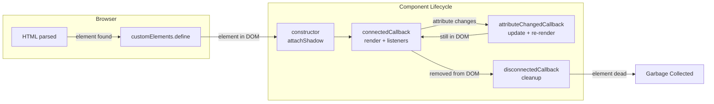
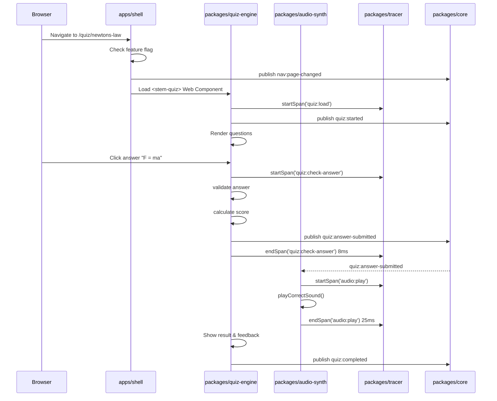

# Components (C4 Level 3)

**Version:** 3.0.0
**Status:** Enforced
**Owner:** Architecture
**Applies To:** All packages and apps
**Related:** `ARCHITECTURE/README.md`, `COMPONENT_STANDARDS.md`, `EVENT_BUS_CONTRACT.md`, `docs/ARCHITECTURE/containers.md`

---

## Component Lifecycle

All interactive components are native Web Components following the standard
lifecycle:



## ACL Communication Pattern

Legacy globals are never called directly from modern code — the ACL adapter wraps
and translates them:

```mermaid
flowchart TB
    subgraph Legacy["Legacy Code (stem-quiz.js)"]
        GF[Global Function:\nwindow.checkAnswer()]
        GM[Global State:\nwindow.currentScore]
    end

    subgraph Adapter["ACL Adapter (packages/acl/)"]
        WR[Wrapper:\nLegacyQuizAdapter]
        EV[Translator: convert\nlegacy format → modern format]
    end

    subgraph Modern["New Code (quiz-engine)"]
        WC[<stem-quiz> Web Component]
        EV2[TypeScript class:\nQuizEngine]
    end

    subgraph Bus["Event Bus"]
        EB[pub/sub]
    end

    WC -->|observedAttributes| EV2
    EV2 -->|CustomEvent + EB| EB
    EB -->|adapter subscribes| WR
    WR -->|calls| GF
    WR -->|reads| GM
    WR -->|translates result| EV
    WR -->|publishes via| EB
    EB -->|modern code receives| EV2
```

**Step-by-step ACL flow:**

1. User clicks an answer in the new `<stem-quiz>` component
2. New `QuizEngine` validates locally (pure logic)
3. If legacy data is needed (e.g., old quiz data format), it publishes an event
4. `LegacyQuizAdapter` (in `packages/acl/`) subscribes and calls the legacy global
5. Adapter translates the legacy result into the modern format
6. Adapter publishes the result back through the Event Bus
7. Modern `QuizEngine` receives it and continues processing

## Data Flow: User Takes a Quiz


