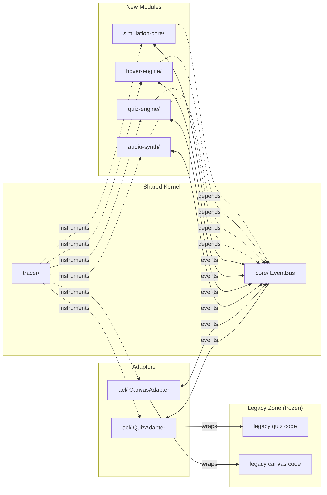

# Containers (C4 Level 2)

**Version:** 3.0.0
**Status:** Enforced
**Owner:** Architecture
**Applies To:** All packages and apps
**Related:** `ARCHITECTURE.md`, `RULES.md`, `docs/ARCHITECTURE/context.md`, `docs/ARCHITECTURE/dependencies.md`

---

## Containers

The system is a pnpm workspace: one application shell, a frozen legacy zone, and
independently versioned packages communicating over an Event Bus.

## Package Map

| Package | Responsibility | Depends on | Key files |
|---------|---------------|------------|-----------|
| `core` | Event Bus, shared types, utilities | (none) | `src/event-bus.ts`, `src/types.ts` |
| `tracer` | Function timing, span trees, live dashboard | `core` | `src/tracer.ts`, `src/dashboard.ts` |
| `acl` | Adapters wrapping legacy code | `core`, `tracer` | `src/quiz-adapter.ts`, `src/canvas-adapter.ts` |
| `audio-synth` | Web Audio API sound effects | `core`, `tracer` | `src/synth.ts` |
| `quiz-engine` | Quiz data, logic, scoring, Web Component | `core`, `tracer` | `src/quiz-engine.ts`, `src/stem-quiz.ts` |
| `hover-engine` | Hover style state machine, cooldown protocol | `core`, `tracer` | `src/hover-state.ts`, `src/styles.css` |
| `simulation-core` | Pure physics math (Newtonian gravity) | `core`, `tracer` | `src/physics.ts`, `src/create-body.ts` |
| `shell` | App entry, routing between legacy and modern | (all packages) | `public/index.html` |

The live package map (phase + key files) is also machine-generated into `AGENTS.md`
by `docs:sync`. Full import rules are in `dependencies.md`.
