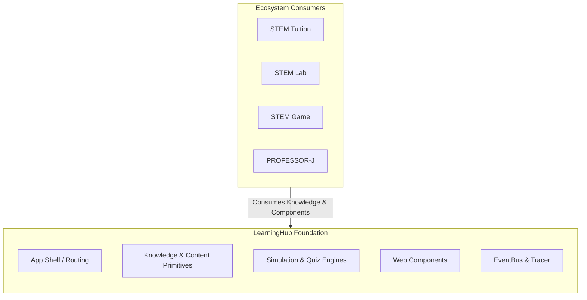

# System Context (C4 Level 1)

**Version:** 3.0.0
**Status:** Enforced
**Owner:** Architecture
**Applies To:** All packages and apps
**Related:** `VISION.md`, `ECOSYSTEM.md`, `ARCHITECTURE/README.md`, `RULES.md`, `docs/ARCHITECTURE/overview.md`

---

## Context

LearningHub is an open, product-agnostic STEM education platform and foundation. Users and downstream products access it through standard Web Component interfaces, EventBus APIs, and content export models.


        L[index.html]
        L --> CSS[css/main.css]
        L --> JS1[js/stem-effects.js]
        L --> JS2[js/stem-quiz.js]
        L --> JS3[js/stem-pioneers.js]
        L --> JS4[js/main.js]
    end

    subgraph ACL["packages/acl/"]
        direction TB
        A1[QuizAdapter]
        A2[CanvasAdapter]
    end

    subgraph MODERN["packages/ (New Modules)"]
        direction TB
        CORE[core/ EventBus]
        TR[tracer/ Observability]
        AS[audio-synth/]
        QE[quiz-engine/]
        HE[hover-engine/]
        SC[simulation-core/]
    end

    B -->|HTTP Request| SHELL
    L -.->|wrapped by| ACL
    ACL -->|talks via| CORE
    MODERN -->|publish/subscribe| CORE
    MODERN -->|instrumented by| TR
```

**External systems:** none required at runtime today. Static hosting (GitHub
Pages / any static host) serves the built assets. See `migration.md` for the
planned backend evolution.
