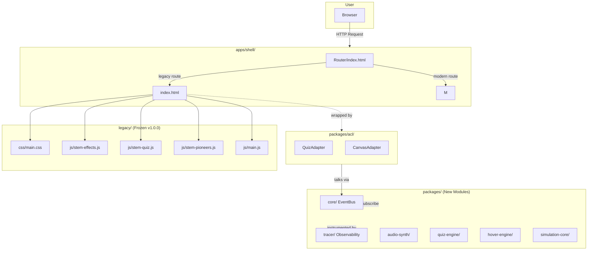

# System Context (C4 Level 1)

**Version:** 3.0.0
**Status:** Enforced
**Owner:** Architecture
**Applies To:** All packages and apps
**Related:** `ARCHITECTURE/README.md`, `RULES.md`, `docs/ARCHITECTURE/overview.md`

---

## Context

STEM-TUITION is a modular STEM education platform. Users access it through a
browser; the platform is served statically today and may gain a backend over time.

**External systems:** none required at runtime today. Static hosting (GitHub
Pages / any static host) serves the built assets. See `migration.md` for the
planned backend evolution.
