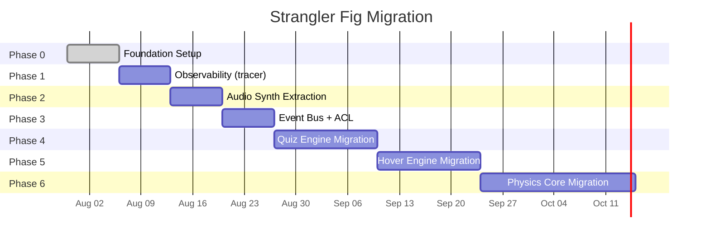
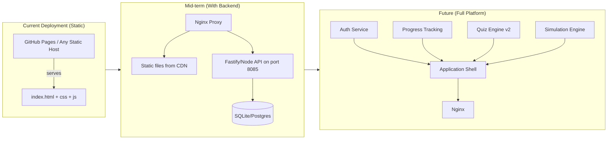

# Migration

**Version:** 3.0.0
**Status:** Enforced
**Owner:** Architecture
**Applies To:** All packages and apps
**Related:** `ARCHITECTURE.md`, `ROADMAP.md`, `docs/RULES.md`, `docs/adr/001-strangler-fig-migration.md`, `docs/ARCHITECTURE/overview.md`

---

## Strangler Fig Progress

The project migrates the frozen legacy monolith into `packages/*` phase by phase.
The canonical phase state lives in `.phase.json` (see `docs/RULES.md` → Release &
Versioning Governance).

**Rules of migration:**

- New functionality MUST be created in `packages/` or `apps/`, never in `legacy/`
- `legacy/` is frozen — MAY only be modified for critical security patches
- Every migration MUST have a documented rollback plan
- See `docs/RULES.md` → Migration Protocols

## Deployment Evolution

