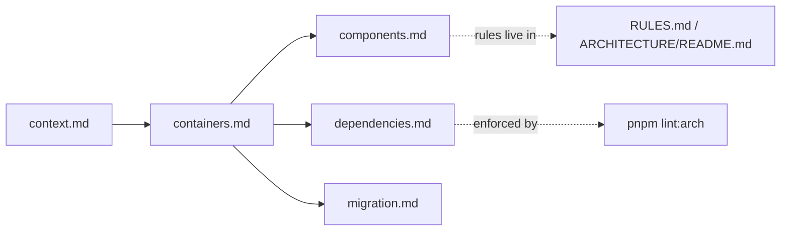

# Architecture Overview

**Version:** 3.0.0
**Status:** Enforced
**Owner:** Architecture
**Applies To:** All packages and apps
**Related:** `ARCHITECTURE/README.md`, `RULES.md`, `COMPONENT_STANDARDS.md`, `docs/ARCHITECTURE/`

---

## Purpose

This directory is the **C4-style diagram set** for STEM-TUITION. It replaces
`FLOWCHARTS.md` as the canonical location for architecture diagrams. The prose
overview, module layout, and dependency rules remain in the charter,
`docs/ARCHITECTURE/README.md`.

| File | C4 Level | Covers |
|------|----------|--------|
| `overview.md` | — | This index + how the set fits together |
| `context.md` | Level 1 — System Context | Users, browsers, external systems |
| `containers.md` | Level 2 — Containers | `apps/shell`, `legacy/`, `packages/*`, dependency graph |
| `components.md` | Level 3 — Components | Key components, lifecycle, ACL pattern, data flow |
| `dependencies.md` | — | Import rules, allowed/forbidden edges, package map |
| `migration.md` | — | Strangler Fig progress, deployment evolution |

## How the set fits together

**Update triggers:** any change to package topology, module boundaries, import
rules, external integrations, or migration state MUST update the relevant diagram
in this directory (see `docs/RULES.md` → Architecture Documentation).
