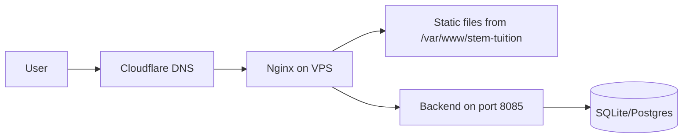

# Deployment Guide

**Version:** 2.0.0  
**Purpose:** How to deploy STEM-TUITION to production at every stage of the migration.

---

## Current State: Static Hosting

The entire site is static HTML/CSS/JS. Deploy to any static host:

### GitHub Pages

```bash
# 1. Push to main branch
git push origin main

# 2. In GitHub repo Settings → Pages:
#    Source: GitHub Actions (recommended)
#    OR: Deploy from branch: main, / (root)

# 3. Site will be at: https://<username>.github.io/STEM-TUITION/
```

### Cloudflare Pages

```bash
# 1. Connect GitHub repo to Cloudflare Pages
# 2. Build command: (none — static files)
# 3. Publish directory: ./
# 4. Deploy
```

### Manual (Any Static Host)

```bash
# Copy the entire project to your host's public directory
cp -r . /var/www/stem-tuition/
```

---

## Mid-Term: Static + API (VPS)

When you add a backend (Fastify/Node on port 8085):



### Nginx Configuration

```nginx
server {
    listen 443 ssl http2;
    server_name stemtuitionpokhara.com;

    ssl_certificate /etc/letsencrypt/live/stemtuitionpokhara.com/fullchain.pem;
    ssl_certificate_key /etc/letsencrypt/live/stemtuitionpokhara.com/privkey.pem;

    root /var/www/stem-tuition/legacy;
    index index.html;

    # Static assets with caching
    location ~* \.(css|js|png|jpg|webp|svg|woff2)$ {
        expires 30d;
        add_header Cache-Control "public, no-transform";
    }

    # API routes
    location /api/ {
        proxy_pass http://127.0.0.1:8085;
        proxy_http_version 1.1;
        proxy_set_header Upgrade $http_upgrade;
        proxy_set_header Connection 'upgrade';
        proxy_set_header Host $host;
        proxy_set_header X-Real-IP $remote_addr;
    }

    # Security headers
    add_header X-Frame-Options "SAMEORIGIN" always;
    add_header X-Content-Type-Options "nosniff" always;
    add_header Referrer-Policy "strict-origin-when-cross-origin" always;
    add_header Content-Security-Policy "default-src 'self' https:; script-src 'self' 'unsafe-inline'; style-src 'self' 'unsafe-inline' https://fonts.googleapis.com; font-src 'self' https://fonts.gstatic.com;" always;
}
```

---

## Future: Full Platform

When the Strangler Fig migration completes and modern modules serve directly:

```bash
# Build all packages
pnpm build

# Deploy shell (routes to modern modules)
cp -r apps/shell/dist/* /var/www/stem-tuition/

# Deploy legacy as fallback
cp -r legacy/ /var/www/stem-tuition/legacy/
```

---

## Environment Variables

Create a `.env.local` file (never committed):

```bash
# Production URL
SITE_URL=https://stemtuitionpokhara.com

# API (future)
API_PORT=8085
DATABASE_URL=file:/var/data/stem.db

# WhatsApp (legacy integration)
WHATSAPP_NUMBER=9779768021317

# Security
SESSION_SECRET=<generate-random-64-char-string>
```

---

## CI/CD Pipeline (GitHub Actions)

```yaml
name: Deploy

on:
  push:
    branches: [main]

jobs:
  deploy:
    runs-on: ubuntu-latest
    steps:
      - uses: actions/checkout@v4
      - uses: pnpm/action-setup@v2
      - run: pnpm install --frozen-lockfile
      - run: pnpm verify-governance
      - run: pnpm build
      
      # Deploy to GitHub Pages
      - uses: peaceiris/actions-gh-pages@v3
        with:
          github_token: ${{ secrets.GITHUB_TOKEN }}
          publish_dir: .
```

---

## Rollback

```bash
# Option 1: Revert to previous git tag
git checkout v1.0.0
cp -r . /var/www/stem-tuition/

# Option 2: Disable feature flag (no deploy needed)
# Just remove ?new_quiz=true from URL

# Option 3: Quick revert
git revert HEAD --no-edit
git push origin main
```
