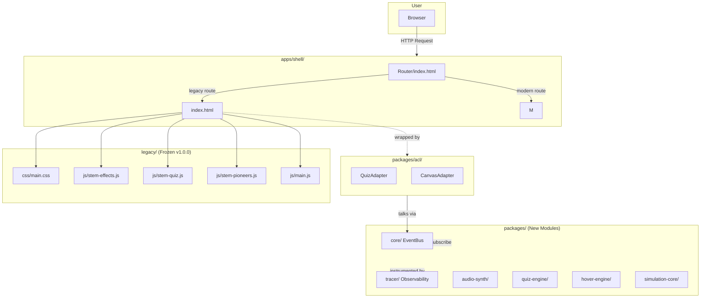
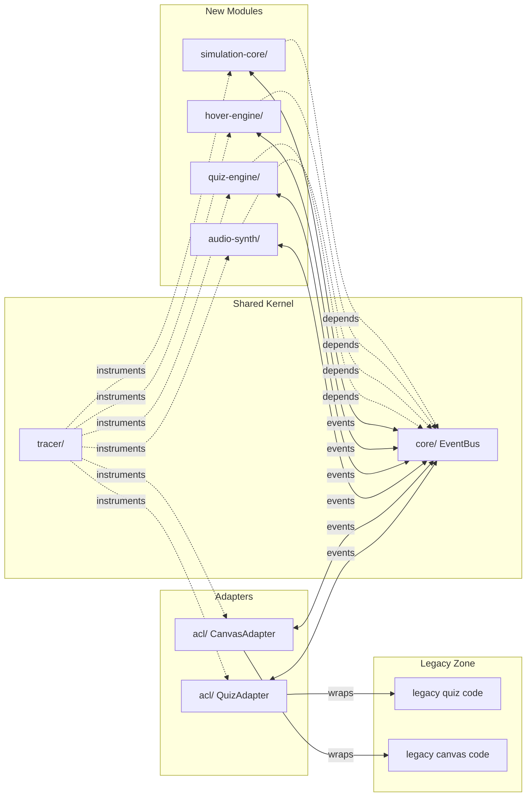
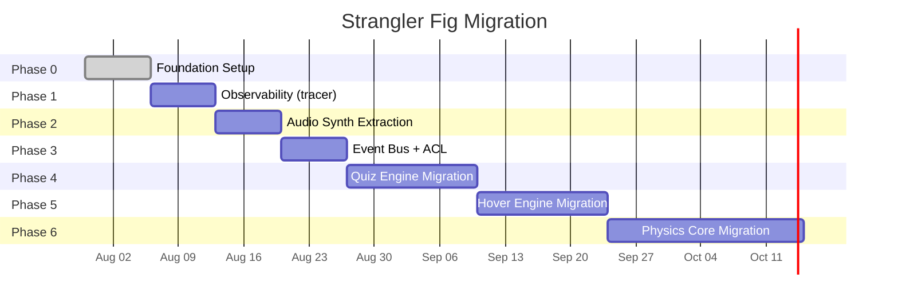
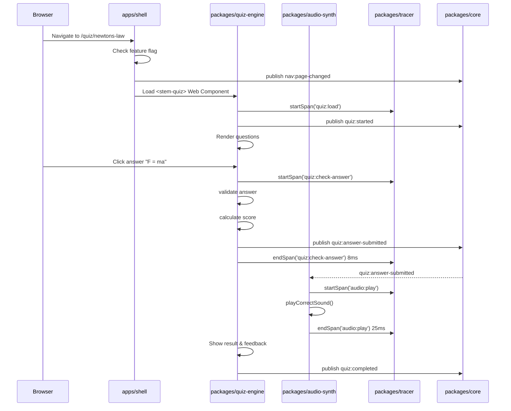
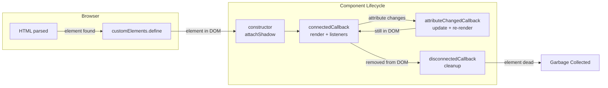
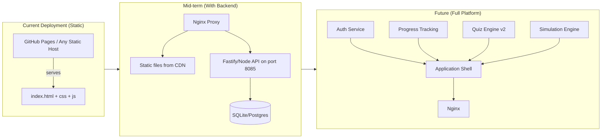
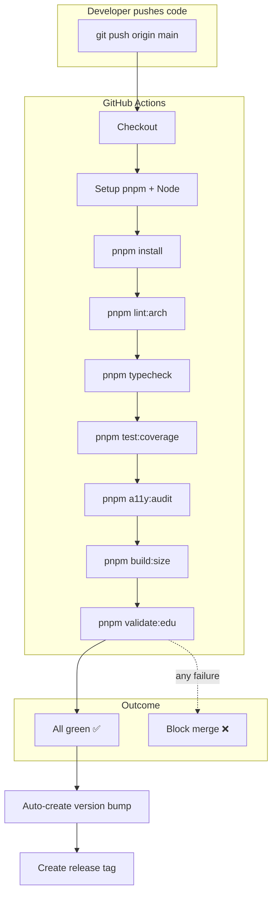

# STEM-TUITION Flowcharts

**Version:** 3.0.0
**Purpose:** Visual diagrams of architecture, data flow, and module connections

---

## 1. System Architecture (High Level)



---

## 2. Module Dependency Graph



---

## 3. Strangler Fig Migration Progress



---

## 4. Data Flow: User Takes a Quiz



---

## 5. ACL Communication Pattern

```mermaid
flowchart TB
    subgraph Legacy["Legacy Code (stem-quiz.js)"]
        GF[Global Function:\nwindow.checkAnswer()]
        GM[Global State:\nwindow.currentScore]
    end

    subgraph Adapter["ACL Adapter (packages/acl/)"]
        WR[Wrapper:\nLegacyQuizAdapter]
        EV[Translator: convert\nlegacy format → modern format]
    end

    subgraph Modern["New Code (quiz-engine)"]
        WC[<stem-quiz> Web Component]
        EV2[TypeScript class:\nQuizEngine]
    end

    subgraph Bus["Event Bus"]
        EB[pub/sub]
    end

    WC -->|observedAttributes| EV2
    EV2 -->|CustomEvent + EB| EB
    EB -->|adapter subscribes| WR
    WR -->|calls| GF
    WR -->|reads| GM
    WR -->|translates result| EV
    WR -->|publishes via| EB
    EB -->|modern code receives| EV2
```

### 5.1 Step-by-step ACL flow

1. User clicks answer in the new `<stem-quiz>` component
2. New `QuizEngine` validates locally (pure logic)
3. If it needs legacy data (e.g., old quiz data format), it publishes an event
4. `LegacyQuizAdapter` (in `packages/acl/`) subscribes, calls the legacy global function
5. Adapter translates the legacy result into the modern format
6. Adapter publishes the result back through the Event Bus
7. Modern `QuizEngine` receives it, continues processing

---

## 6. Component Lifecycle



---

## 7. Trace Waterfall (Live Debugging View)

```
┌──────────────────────────────────────────────────────┐
│  TRACE: quiz:answer-submitted (45ms)                  │
│  ┌─ quiz-engine:validate-answer ............. 2ms     │
│  ├─ quiz-engine:check-answer ................ 8ms     │
│  ├─ quiz-engine:calculate-score ............. 3ms     │
│  ├─ event-bus:publish ....................... 1ms     │
│  ├─ audio-synth:play-correct-sound ......... 25ms    ◄── SLOW
│  └─ ═══════════════════════════════════════ 39ms     │
│                                                       │
│  SLOWEST: audio-synth:play-correct-sound (25ms)       │
│  Can we optimize? → Consider pre-loading audio        │
└──────────────────────────────────────────────────────┘
```

This is visible in the browser console when `?trace=true` is enabled, or in the floating Tracer Dashboard panel.

---

## 8. Deployment Evolution



---

## 9. CI/CD Pipeline


