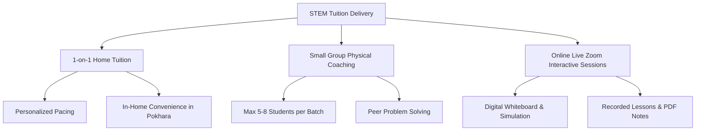

# 📋 STEM Tuition — Operations & Standard Operating Procedures (SOP)

This document details the operational framework, session delivery modes, parent-tutor communication protocols, and student tracking procedures for **STEM Tuition Pokhara**.

For development, technical rules, and architecture guidelines, refer to [docs/RULES.md](file:///home/sajan/STEM-TUTION/docs/RULES.md).

---

## 1. Tuition Delivery Modes

STEM Tuition offers flexible, tailored learning environments designed to meet the distinct needs of students in Pokhara and beyond.



### Mode 1: 1-on-1 Home Tuition (Pokhara Region)
- **Coverage**: Lakeside, New Road, Chipledhunga, Prithvi Chowk, Birauta, Lamachaur, and surrounding areas in Pokhara.
- **Session Duration**: 1.5 hours to 2 hours per session.
- **Best For**: Students requiring dedicated individual attention, exam recovery, or fast-paced competitive entrance prep.

### Mode 2: Small Group Physical Coaching
- **Location**: STEM Learning Hub Center, Pokhara.
- **Batch Size**: Strictly capped at **5 to 8 students** to preserve individual interaction.
- **Environment**: Collaborative problem-solving, peer discussions, weekly diagnostic tests.

### Mode 3: Online Live Interactive Sessions
- **Platform**: Zoom / Google Meet integrated with digital drawing tablets and interactive STEM simulations.
- **Deliverables**: Real-time class session recordings + high-resolution annotated PDF whiteboard notes.

---

## 2. Student Enrollment & Intake Workflow

```text
Step 1: Initial Inquiry (Website Interactive Card / WhatsApp +977 9768021317)
  └── Student selects grade level (1-8, 9-10 SEE, 11-12 NEB, A-Levels) and subjects.

Step 2: Free Diagnostic Demo Session
  └── Tutor assesses current conceptual knowledge, problem areas, and learning pace.

Step 3: Personalized Learning Plan & Timetable Assignment
  └── Agree on weekly class frequency, timing slots, and fee structure.

Step 4: Formal Registration & Course Kit Dispatch
  └── Access granted to online resources, digital notes, and STEM Web Quiz Portal.
```

---

## 3. Parent Communication & Diagnostic Assessment

- **Weekly Progress Feedback**: Progress reports sent via WhatsApp to parents after every chapter completion.
- **Monthly Mock Tests**: Timed test papers matching SEE / NEB board patterns.
- **Contact Details**: Phone: `+977 9768021317` | Email: `gurungsajan0228@gmail.com`
