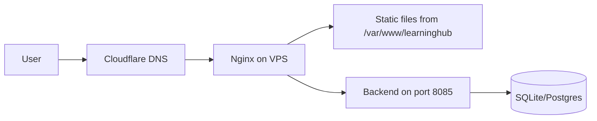

# LearningHub Deployment Guide

**Version:** 3.0.0
**Purpose:** How to deploy LearningHub to production at every stage of the migration.
**Last Updated:** 2026-09-02

---

## Current State: Cloudflare Pages (Recommended)

The entire site is built as static HTML/CSS/JS via Vite + TypeScript. Deploy to
**Cloudflare Pages** for automatic HTTPS, global CDN, and zero-config SSL.

### 🚀 Automated Deploy (CI/CD Pipeline)

The repository includes a fully automated deployment pipeline:

| Trigger | Workflow | What Happens |
|---------|----------|-------------|
| Push to `main` | `.github/workflows/deploy.yml` | Build → Deploy → Health Check |
| Manual trigger | `deploy.yml` (workflow_dispatch) | Same as above |
| PR preview | Cloudflare Pages (auto) | Per-branch preview URL |

**How it works:**

```text
git push origin main
        │
        ▼
  GitHub Actions: ci.yml
        │  └─ verify-governance (11-stage gate)
        ▼
  GitHub Actions: deploy.yml
        │  └─ pnpm install --frozen-lockfile
        │  └─ pnpm --filter @learninghub/shell build
        │  └─ wrangler pages deploy apps/shell/dist --project-name=learninghubstem
        │  └─ curl /health.json → 200 OK
        ▼
  Cloudflare Pages → learninghubstem.pages.dev
        │  └─ Automatic HTTPS (SSL/TLS)
        │  └─ Global CDN (330+ locations)
        │  └─ Auto-renewed certificates
        ▼
  Uptime Monitor (every 5 min)
        └─ .github/workflows/monitor.yml
        └─ Creates GitHub Issue on failure
```

### One-Time Setup

```bash
# 1. Create a Cloudflare Pages project
#    - Go to https://dash.cloudflare.com/ → Pages → Create a project
#    - Connect your GitHub repo (private repos work fine)
#    - Project name: learninghubstem
#    - Build command: pnpm --filter @learninghub/shell build
#    - Build output: apps/shell/dist
#    - Deploy!

# 2. Add GitHub Actions secrets for CI/CD deployment
#    Go to GitHub repo → Settings → Secrets and variables → Actions
#    Add these secrets:
#    - CF_API_TOKEN: Cloudflare API token with Pages write permission
#    - CF_ACCOUNT_ID: Your Cloudflare account ID
#    - SITE_URL: Your production URL (optional, defaults to learninghubstem.pages.dev)

# 3. Verify
git push origin main
# → GitHub Actions runs ci.yml → deploy.yml
# → Site goes live at https://learninghubstem.pages.dev
```

### Custom Domain

```bash
# In Cloudflare Pages dashboard:
# 1. Go to your project → Custom domains → Set up a custom domain
# 2. Enter your domain (e.g., stemtuitionpokhara.com)
# 3. Cloudflare automatically provisions SSL/TLS certificates
# 4. Update your DNS records (Cloudflare nameservers or CNAME)
```

### Preview Deployments

Every PR gets a unique preview URL automatically:

```text
https://<branch-name>.learninghubstem.pages.dev
```

This allows testing changes before merging to main. No extra setup needed.

---

## SSL/TLS (Automatic)

Cloudflare provides **free, auto-renewed SSL/TLS certificates** for all Pages
deployments:

- **Full (strict)** mode by default — end-to-end encryption
- **Auto-renewal** — Cloudflare handles certificate renewal, no certbot needed
- **HTTP/2 and HTTP/3** support automatically
- **HSTS** can be enabled in the Cloudflare dashboard

**No manual SSL setup, certbot, or renewal scripts needed.** This replaces the
VPS-based Let's Encrypt approach described in the Legacy section below.

---

## Legacy: VPS + Nginx (If Self-Hosting)

If you choose to self-host on a VPS instead of Cloudflare Pages:

When you add a backend (Fastify/Node on port 8085):



### Nginx Configuration

```nginx
server {
    listen 443 ssl http2;
    server_name stemtuitionpokhara.com;

    ssl_certificate /etc/letsencrypt/live/stemtuitionpokhara.com/fullchain.pem;
    ssl_certificate_key /etc/letsencrypt/live/stemtuitionpokhara.com/privkey.pem;

    root /var/www/learninghub/legacy;
    index index.html;

    # Static assets with caching
    location ~* \.(css|js|png|jpg|webp|svg|woff2)$ {
        expires 30d;
        add_header Cache-Control "public, no-transform";
    }

    # API routes
    location /api/ {
        proxy_pass http://127.0.0.1:8085;
        proxy_http_version 1.1;
        proxy_set_header Upgrade $http_upgrade;
        proxy_set_header Connection 'upgrade';
        proxy_set_header Host $host;
        proxy_set_header X-Real-IP $remote_addr;
    }

    # Security headers
    add_header X-Frame-Options "SAMEORIGIN" always;
    add_header X-Content-Type-Options "nosniff" always;
    add_header Referrer-Policy "strict-origin-when-cross-origin" always;
    add_header Content-Security-Policy "default-src 'self' https:; script-src 'self' 'unsafe-inline'; style-src 'self' 'unsafe-inline' https://fonts.googleapis.com; font-src 'self' https://fonts.gstatic.com;" always;
}
```

---

## Future: Full Platform

The Strangler Fig migration is complete (Phases 0–6). The modern shell app
(`apps/shell`) serves all content. Future phases will add API-backed features.

```bash
# Build all packages
pnpm build

# Deploy shell (routes to all modern modules)
cp -r apps/shell/dist/* /var/www/learninghub/
```

---

## Environment Variables

Create a `.env.local` file (never committed):

```bash
# Production URL
SITE_URL=https://stemtuitionpokhara.com

# API (future)
API_PORT=8085
DATABASE_URL=file:/var/data/stem.db

# WhatsApp (legacy integration)
WHATSAPP_NUMBER=9779768021317

# Security
SESSION_SECRET=<generate-random-64-char-string>
```

---

## CI/CD Pipeline (GitHub Actions) — ✅ IMPLEMENTED

The repository has the following CI/CD workflows:

| Workflow | File | Trigger | What It Does |
|----------|------|---------|-------------|
| **CI** | `.github/workflows/ci.yml` | PR, push to main | `verify-governance` (11-stage gate), commitlint, dependency audit, Lighthouse CI |
| **Deploy** | `.github/workflows/deploy.yml` | Push to main | Build → Cloudflare Pages → Health check |
| **Smoke** | `.github/workflows/smoke.yml` | PR, push to main | Playwright E2E smoke tests |
| **Monitor** | `.github/workflows/monitor.yml` | Every 5 min (tuition hours) | Curl `/health.json` → create GitHub Issue on failure |
| **Release** | `.github/workflows/release.yml` | Tag push `v*.*.*` | GitHub Release, npm publish, Docker build+sign, SBOM, Discord notify |
| **Nightly** | `.github/workflows/nightly.yml` | 2am daily | Full governance + Lighthouse + audit |
| **Dependabot** | `.github/dependabot.yml` | Weekly (Monday) | Auto-PR for npm + GitHub Actions updates |

**The deploy pipeline is the critical path:**
```text
git push origin main
  → ci.yml (verify)
  → deploy.yml (cloudflare-pages)
  → site goes live
  → monitor.yml (checks every 5 min)
```

---

## Rollback

```bash
# Option 1: Revert to previous git tag
git checkout v1.0.0
cp -r . /var/www/learninghub/

# Option 2: Disable feature flag (no deploy needed)
# Just remove ?new_quiz=true from URL

# Option 3: Quick revert
git revert HEAD --no-edit
git push origin main
```
